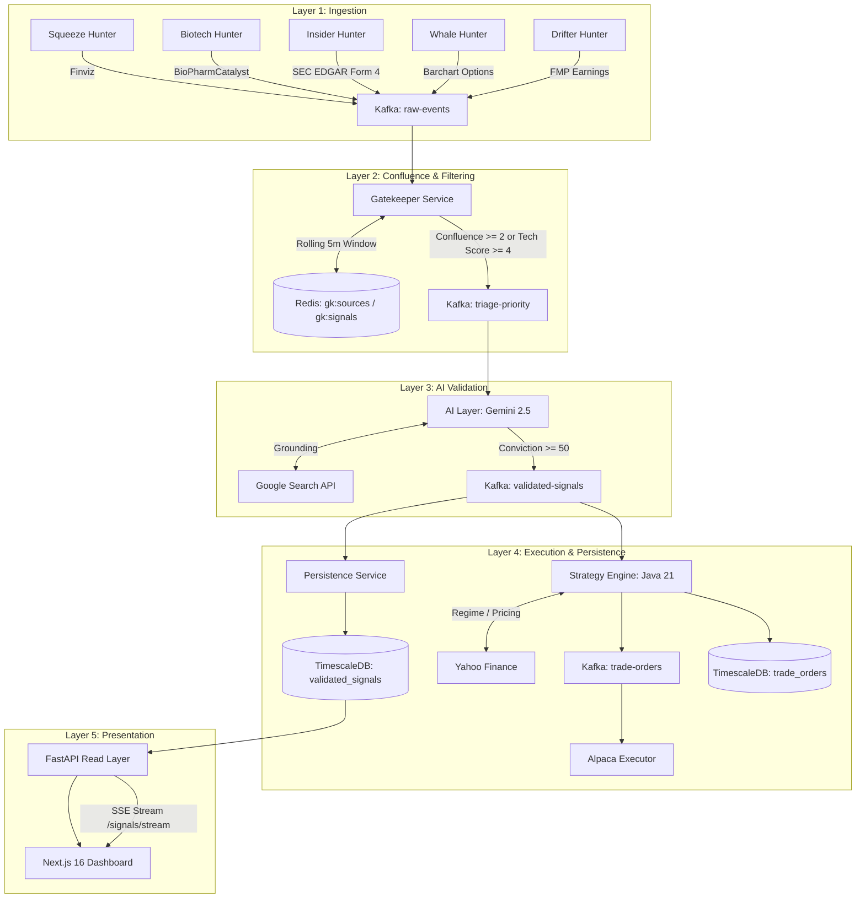

# Catalyst: Agent Operating Manual & Repository Knowledge Base

> **CRITICAL DIRECTIVE FOR ALL AI AGENTS:**
> This document is the living single source of truth for the Catalyst project architecture, subsystems, workflows, and developer conventions.
> **Whenever you discover new insights, modify or add subsystems/endpoints, update schemas, introduce environment variables, or create new skills/tools, YOU MUST UPDATE THIS DOCUMENT IMMEDIATELY.**
> Never leave undocumented findings or obsolete architecture descriptions behind.

---

## 1. Project Overview & North Star

**Catalyst** is an event-driven market signal discovery and algorithmic trade generation pipeline. It aggregates volatile market signals from disparate financial feeds (scrapers, APIs, SEC filings), filters them through a stateful confluence gatekeeper, validates real-time catalysts via Gemini LLM with Google Search grounding, sizes trades via a Java Spring Boot quantitative engine (Half-Kelly criterion and market regime filtering), and exposes actionable signals and orders through a FastAPI backend and Next.js 16 dashboard.

### Core Value Proposition
- **Portfolio-first POC**: Designed to run cost-effectively ($3–8/mo on AWS EC2) during high-probability weekday market windows (06:50 to 16:10 ET) rather than incurring unnecessary 24/7 enterprise infrastructure costs.
- **Explainability**: Raw hunter signals require confluence ($\ge 2$ sources) and AI grounding before being converted into structured trade orders.

---

## 2. System Architecture & Event Topology



### Kafka Topics Reference

| Topic Name | Purpose | Producers | Consumers | Payload Schema |
|---|---|---|---|---|
| `raw-events` | Central hub for all raw scraped market events | Hunters (`squeeze`, `biotech`, `insider`, `whale`, `drifter`) | `gatekeeper` | Raw hunter-specific JSON with `ticker`, `price`, `volume` |
| `signal-squeeze` | Hunter-specific archive for squeeze signals | Squeeze Hunter | Diagnostics / UI | Normalized squeeze event |
| `signal-biotech` | Hunter-specific archive for clinical catalyst signals | Biotech Hunter | Diagnostics / UI | Normalized biotech event |
| `signal-insider` | Hunter-specific archive for Form 4 filings | Insider Hunter | Diagnostics / UI | Form 4 transaction event |
| `signal-whale` | Hunter-specific archive for unusual options sweeps | Whale Hunter | Diagnostics / UI | Options sweep details |
| `signal-earnings` | Hunter-specific archive for earnings beats | Drifter Hunter | Diagnostics / UI | Earnings surprise metrics |
| `triage-priority` | Coalesced events that passed confluence/technical checks | Gatekeeper | AI Layer | Triage payload with accumulated signals & liquidity |
| `validated-signals` | AI-validated catalysts with conviction score $\ge 50$ | AI Layer | Persistence, Strategy Engine | Structured analysis JSON (catalyst type, entry, stop, risks) |
| `trade-orders` | Quantitative orders sized via Half-Kelly and regime | Java Engine | Executor (Alpaca) | Trade order with position size, Kelly fraction, regime |

### Redis Key & Cache Schema

| Key Pattern | Data Type | TTL | Purpose |
|---|---|---|---|
| `gk:sources:{TICKER}` | Set | 300s (5 min) | Unique hunter source names (e.g. `{"squeeze", "insider"}`) seen within rolling window. Used for confluence calculation: `SCARD >= 2`. |
| `gk:signals:{TICKER}` | List | 300s (5 min) | Raw JSON signal payloads collected for this ticker during the window. |
| `gk:sent:{TICKER}` | String | 300s (5 min) | Timestamp of when ticker was forwarded to `triage-priority`. Prevents duplicate forwarding. |
| `gk:baseline_vol:{TICKER}` | String / Hash | 7 Days | 20-day historical volume baseline used for relative volume calculation when upstream hunter lacks RVOL. |

---

## 3. Subsystems Deep Dive

### 3.1 Hunters (`hunters/`)
Independent agents that scan disparate financial data sources and publish to Kafka:
- **Squeeze Hunter (`hunters/squeeze_hunter.py`)**: Scrapes Finviz for high short interest (>25%), high relative volume (>2.0x), price ($2–$60), volume (>200k), and days to cover (>3.0). Emits to `signal-squeeze` and `raw-events`.
- **Biotech Hunter (`hunters/biotech_hunter.py`)**: Scrapes BioPharmCatalyst for FDA decisions, PDUFA dates, and Phase 3 trial readouts. Cleans ticker symbols of exchange prefixes/suffixes.
- **Insider Hunter (`hunters/insider_hunter.py`)**: Parses SEC EDGAR Form 4 XML filings for open-market insider purchases (`transaction_code == "P"`). Requires custom SEC User-Agent header.
- **Whale Hunter (`hunters/whale_hunter.py`)**: Uses Playwright headless Chromium to scrape Barchart for unusual options flow and out-of-the-money call/put sweeps.
- **Drifter Hunter (`hunters/drifter_hunter.py`)**: Queries FMP earnings calendar API for post-earnings announcements with EPS surprise $\ge 5.0\%$. Caches seen earnings in an in-memory set to prevent duplicate emissions.
- **CLI Orchestrator (`hunters/main.py`)**: Runs hunters on-demand, in parallel, or sequentially with `--timeout` protection:
  ```bash
  python -m hunters.main all --timeout 30
  ```

### 3.2 Gatekeeper (`gatekeeper/`)
The noise filter protecting the AI Layer from costly API query floods:
- **Normalization**: Robust ticker normalization strips dollar signs (`$TSLA` $\to$ `TSLA`), uppercase conversion, strips exchange prefixes (`NASDAQ:AAPL` $\to$ `AAPL`), strips newlines, and drops Canadian/foreign suffixes (`BIIB.TO` $\to$ `BIIB`).
- **Confluence Rule**: Requires $\ge 2$ distinct hunter sources in `gk:sources:{TICKER}` within the rolling 5-minute window OR a single signal with technical score $\ge 4.0$.
- **Hard Filters**: Dropped if volume $< 50,000$, RVOL $< 1.5\times$, or price outside $\$2.00$–$\$500.00$.
- **Deduplication**: Once forwarded, `gk:sent:{TICKER}` is set with a 300-second TTL to suppress duplicate triage queries.

### 3.3 AI Layer (`ai_layer/`)
Synthesizes market signals into structured investment theses using Gemini 2.5:
- **SDK**: Uses `google-genai` SDK (`from google import genai`).
- **Search Grounding**: Injects Google Search tool (`types.Tool(google_search=types.GoogleSearch())`) to ground conviction in real-time SEC filings and breaking news.
- **Model Aliases & Fallbacks**: Maps model names with fallback resilience (`GEMINI_MODEL`, `GEMINI_FALLBACK_MODEL`, e.g., falling back to `gemini-2.5-flash` or `gemini-2.5-pro`).
- **Resilient JSON Parser**: Extracts structured JSON even when wrapped in markdown code fences (````json ... ````) or conversational prefix/suffix prose.
- **Threshold**: Drops signals with `conviction_score < 50`.

### 3.4 Strategy Engine (`engine/`)
Java 21 Spring Boot 3.4 microservice that handles quantitative risk and sizing:
- **Market Regime**: Analyzes SPY 50/200 DMA and VIX to classify market regime (`BULL_QUIET`, `BULL_VOLATILE`, `BEAR_VOLATILE`, `BEAR_QUIET`).
- **Half-Kelly Sizing**: Calculates position size based on win probability derived from AI conviction score and historical odds, capped at 2% account equity risk.
- **Live Price Fetching**: Fetches live quotes from Yahoo Finance. **CRITICAL:** Synthetic tickers (e.g., `TEST1`) cannot be sized and will be skipped; always use real tickers (e.g., `NVDA`) for end-to-end engine sizing tests.
- **Persistence**: Writes generated orders directly into the TimescaleDB `trade_orders` table.

### 3.5 Persistence Service (`persistence/`)
Python background consumer:
- Consumes `validated-signals` and persists records into TimescaleDB `validated_signals` table.
- Indexed on `catalyst_type` and `ticker`.
- Sanitizes incoming payload values and commits Kafka offsets even when skipping malformed payloads to avoid infinite consumer retry loops.

### 3.6 Executor (`executor/`)
Autonomous paper execution bridge:
- Consumes `trade-orders` and executes market/limit orders via the Alpaca Markets API.
- Rate-limiting protection: Handles HTTP 429 with exponential backoff.
- Circuit breaker: Halts automatic execution after consecutive failed orders.
- Order safety caps: Enforces maximum notional value per trade and maximum open positions.

### 3.7 FastAPI Read Layer (`api/`)
Exposes read-optimized endpoints and streaming for the frontend:
- **SSE Stream**: `GET /signals/stream` — Real-time Server-Sent Events broadcasting new validated signals to connected browser clients with keepalive pings.
- **Signals**: `GET /signals` (with `catalyst_type`, `min_conviction`, `is_trap`, `ticker`, and `date_range`), `GET /signals/{id}`, `GET /signals/stats` (KPI aggregations), `GET /signals/export/csv`.
- **Orders & Executions**: `GET /orders` (with lateral join to Alpaca paper executions), `GET /orders/export/csv`, `GET /executions`.
- **Market**: `GET /market/search?q={query}` (auto-complete), `GET /market/quote/{ticker}`, `GET /market/history/{ticker}`, `GET /market/overview`.
- **Health & Telemetry**: `GET /health` (API & DB pool), `GET /health/pipeline` (Aggregate status: API + TimescaleDB + Redis + Java Engine), `GET /metrics` (Prometheus gauge metrics for API uptime, DB pool connections, and Redis status `catalyst_redis_up`).
- **Testing & Diagnostics**: `POST /testing/inject` (Developer synthetic catalyst signal injection into `raw-events`).
- **Settings**: `POST /settings/alpaca/validate` (credential pre-flight testing).
- **Security Middleware**: Enforces `nosniff`, `X-Frame-Options: DENY`, `X-XSS-Protection`, and `Referrer-Policy`.

### 3.8 Frontend Dashboard (`frontend/`)
Next.js 16 (App Router) + React 19 + Tailwind CSS 4:
- **Pages**:
  - `/`: Executive KPI overview and recent activity.
  - `/signals`: Interactive signals table, KPI ribbon (`/signals/stats`), CSV export, date range filters, and signal detail drawer.
  - `/analytics`: Portfolio performance, win rate, equity curve, regime breakdown.
  - `/settings`: Alpaca API key validation form, real-time pipeline telemetry card (`/health/pipeline`), and developer synthetic signal injection test panel.
- **Components**:
  - `LiveStreamBanner`: Real-time SSE alert banner with connection status, auto-refresh toggle, and Web Audio API synthesized alert chime.
  - `PipelineStatus`: Live status indicator in navbar reflecting API, DB, Redis, and Java Engine health with interactive tooltip diagnostics.
  - `TickerSearchInput`: Keyboard-navigable ticker auto-complete dropdown.
  - `PriceChart`: TradingView Lightweight Charts component with live vs. synthetic history indicator.
  - `SignalFilterBar`: Interactive catalyst, conviction, trap, and date range pills (`7D`, `30D`, `90D`, `All Time`).

---

## 4. Platform Upgrades & Evolution (Phases 1–27)

| Phase | Core Deliverable | Key Details |
|---|---|---|
| **Phase 1** | Repository upgrades & async performance | Refactored API database pool, signal detail API, Docker setup, and base test suite. |
| **Phase 2** | Robust JSON parsing & font optimization | Code fence stripping in AI Layer, Finviz hunter table parsing, local font caching. |
| **Phase 3** | Market quote API & daemon reconnect | `/market/quote/{ticker}` endpoint via yfinance, auto-reconnect backoff for Kafka daemons. |
| **Phase 4** | Hunter HTTP retry resilience | Exponential backoff for HTTP requests, execution telemetry, and signal filters. |
| **Phase 5** | UI slide reset & analytics enhancements | Refined UI cards, equity curve charts, and dark theme consistency. |
| **Phase 6** | Dashboard filters & rollback hardening | Executive KPI cards, biotech ticker sanitization, DB consumer rollback on errors (150 tests). |
| **Phase 7** | Market overview bar & health telemetry | Global market bar (SPY, QQQ, VIX), `/health/pipeline` endpoint, Finviz pagination fix (153 tests). |
| **Phase 8** | CSV data export engine | Streaming CSV downloads for `/signals/export/csv` and `/orders/export/csv`, settings UI (155 tests). |
| **Phase 9** | SSE real-time signal stream | `GET /signals/stream` SSE endpoint with keepalive pings and async connection warmup (156 tests). |
| **Phase 10** | Security headers & ticker auto-complete | `GET /market/search`, HTTP security headers middleware (nosniff, DENY) (157 tests). |
| **Phase 11** | TickerSearchInput component | Reusable UI search component with keyboard navigation (Up/Down/Enter/Escape). |
| **Phase 12** | Alpaca rate limits & circuit breaker | Exponential backoff on HTTP 429, execution circuit breaker, max order constraints (167 tests). |
| **Phase 13** | Performance fast_info fallback | Resilient financial data extraction using yfinance `fast_info` with defensive guards (175 tests). |
| **Phase 14** | LiveStreamBanner SSE component | Client-side SSE consumer with automatic exponential backoff reconnection. |
| **Phase 15** | Persistence catalyst indexing | Index on `catalyst_type`, offset commits on malformed payloads to prevent consumer stall (177 tests). |
| **Phase 16** | Redis baseline volume TTL | Added 7-day TTL on `gk:baseline_vol:{ticker}` keys to prevent Redis memory exhaustion. |
| **Phase 17** | Timestamp & source hunter parity | Standardized `timestamp_utc` and `source_hunter` fields across all hunters. |
| **Phase 18** | Market history test coverage | Added unit tests for `/market/history/{ticker}` empty handling and success paths (179 tests). |
| **Phase 19** | Alpaca credential pre-validation | `POST /settings/alpaca/validate` endpoint and frontend credential verification form (183 tests). |
| **Phase 20** | Web Audio API chime in live stream | Pure browser synthesized audio alert chime (no external mp3 asset required) and auto-sync toggle. |
| **Phase 21** | AI Layer fallback model mechanism | `GEMINI_FALLBACK_MODEL` integration with retry and alias normalization (186 tests). |
| **Phase 22** | Signals statistics endpoint & KPI ribbon | `GET /signals/stats` endpoint and real-time statistics ribbon on the Signals page (187 tests). |
| **Phase 23** | Hunter orchestrator telemetry & timeouts | CLI orchestrator (`hunters/main.py`) with `--timeout` flag, duration tracking, and test suite (191 tests). |
| **Phase 24** | Gatekeeper ticker normalization | Strips `$`, exchange prefixes (`NASDAQ:`), newlines, and foreign suffixes (`.TO`) (191 tests). |
| **Phase 25** | Utility scripts & full diagnostics suite | Added `confluence_watcher.py`, `inject_synthetic_signals.py`, React 19 hook purity fixes, and 4 agent skills (197 tests). |
| **Phase 26** | Execution parity, Prometheus metrics & date filters | Order executions lateral join, signals date range filtering (`7d`/`30d`/`90d`), `POST /testing/inject`, `GET /metrics`, Next.js 16 `proxy.ts` (203 tests). |
| **Phase 27** | Redis health telemetry, schedule parity & verification probe | Redis async health check in API (`ping_redis()`), aggregate `/health/pipeline` (`api`, `database`, `redis`, `engine`, `ready`), Prometheus `catalyst_redis_up` gauge, EventBridge shutdown alignment (16:10 ET / 20:10 UTC), and automated `scripts/verify_pipeline_health.py` CLI probe (211 tests). |
| **Phase 28** | Critical bug fixes, Java engine tests & Frontend test suite | Fixed 11 critical bugs (SSE DB pool starvation, TradeList execution wipe, Gatekeeper/AI Kafka offset commits, negative price checks, dual-class tickers `.A`/`.B`/`.C`/`.WS`, settings `isConnected` state, AudioContext leak, CDK `t3.medium`/30GB sizing, Prometheus active pool metric). Added 33-test Java engine JUnit 5 suite (Lombok 1.18.34, strategies, RegimeFilter, KellySizer). Added 31-test frontend Vitest + Testing Library suite (276 total automated tests across stack). |

---

## 5. Developer & Agent Guidelines

### 5.1 Python Environment & Testing
- **Virtual Environment**: Always use `.venv/bin/pytest` and `.venv/bin/ruff` (Python 3.12).
- **Running Pytest**:
  ```bash
  .venv/bin/pytest
  ```
  *Current status: 212 passing tests.*
- **Linting & Code Style**:
  ```bash
  .venv/bin/ruff check .
  ```
  Follow PEP 8, use strict type hints (`from typing import ...`), prefer `pathlib.Path` over `os.path`.

### 5.2 Frontend Environment & Testing
- **Location**: `frontend/` directory.
- **Unit & Component Testing (Vitest)**:
  ```bash
  npm --prefix frontend run test
  ```
  *Current status: 31 passing tests.*
- **Type Checking**:
  ```bash
  npm --prefix frontend run typecheck
  ```
- **Linting**:
  ```bash
  npm --prefix frontend run lint
  ```
- **Production Build**:
  ```bash
  npm --prefix frontend run build
  ```

### 5.3 Java Strategy Engine Testing
- **Location**: `engine/` directory.
- **Java Version**: Java 21 (Temurin).
- **Running Tests**:
  ```bash
  export JAVA_HOME=/Users/alesio/Library/Java/JavaVirtualMachines/temurin-21.0.11/Contents/Home && cd engine && mvn -B test
  ```
  *Current status: 33 passing tests (0 failures).*

- **React 19 & Next.js 16 Rules**:
  - Never mutate ref values (`ref.current = value`) during rendering. Use `useEffect` or lazy state initializers.
  - Never call `setState()` synchronously in the root of a `useEffect` hook.
  - Use `src/proxy.ts` for route interception and proxying instead of deprecated `middleware.ts`.

### 5.4 Working with Docker Compose
- Start infrastructure only:
  ```bash
  docker compose up -d zookeeper kafka redis gatekeeper ai-layer persistence catalyst-api
  ```
- Start all services:
  ```bash
  docker compose up -d --build
  ```
- Inspect logs:
  ```bash
  docker logs -f catalyst_gatekeeper
  docker logs -f catalyst_ai_layer
  docker logs -f catalyst_engine
  ```

---

## 6. Workspace Skills Catalog

The repository provides specialized agent skills in `.agents/skills/`:

1. **`pipeline-e2e-testing`** ([SKILL.md](file:///Users/alesio/Developer/Projects/catalyst/.agents/skills/pipeline-e2e-testing/SKILL.md)):
   - Complete guide for injecting synthetic signals (`scripts/inject_synthetic_signals.py`) into Kafka `raw-events` and verifying Gatekeeper confluence, Redis caching, AI validation, and Java engine order sizing.
2. **`hunter-management`** ([SKILL.md](file:///Users/alesio/Developer/Projects/catalyst/.agents/skills/hunter-management/SKILL.md)):
   - Operational guide for running, configuring, and testing market hunters via `python -m hunters.main`, managing scraper rate limits, and implementing new hunters.
3. **`catalyst-diagnostics`** ([SKILL.md](file:///Users/alesio/Developer/Projects/catalyst/.agents/skills/catalyst-diagnostics/SKILL.md)):
   - Comprehensive test runner, ruff linting, TypeScript typechecking, and health telemetry verification instructions.
4. **`aws-catalyst-deployment`** ([SKILL.md](file:///Users/alesio/Developer/Projects/catalyst/.agents/skills/aws-catalyst-deployment/SKILL.md)):
   - AWS CDK provisioning (`infra/catalyst_stack.py`), EC2 bootstrap (`scripts/ec2-bootstrap.sh`), and Lambda/EventBridge automated market-hour scheduling.

---

## 7. Operational Troubleshooting & Gotchas

1. **Synthetic Tickers & Java Engine**:
   - `TEST*` or synthetic tickers injected into Kafka will pass through Gatekeeper and AI Layer without issue.
   - However, the Java Strategy Engine calls Yahoo Finance to get market price and calculate historical volatility for Kelly position sizing.
   - For non-existent tickers, the engine skips sizing and will NOT create a `trade_order`.
   - **Fix**: When testing the full pipeline through to `trade_orders`, always use real tickers (e.g., `NVDA`, `AAPL`, `MSFT`).
2. **Redis Memory Protection**:
   - `gk:sources:*` and `gk:signals:*` keys expire automatically after 300 seconds.
   - `gk:baseline_vol:*` keys expire after 7 days.
   - If Redis becomes cluttered during testing: `redis-cli FLUSHDB`.
3. **Kafka Consumer Offset Commit on Skipped Payloads**:
   - Both Gatekeeper and Persistence services commit offsets even when a payload is dropped or invalid to prevent endless poison-pill reprocessing loops.
4. **AWS Deployment Cost Controls**:
   - EventBridge rules are deployed **disabled** by default.
   - Always verify Lambda execution manually before enabling automated weekday schedules.
