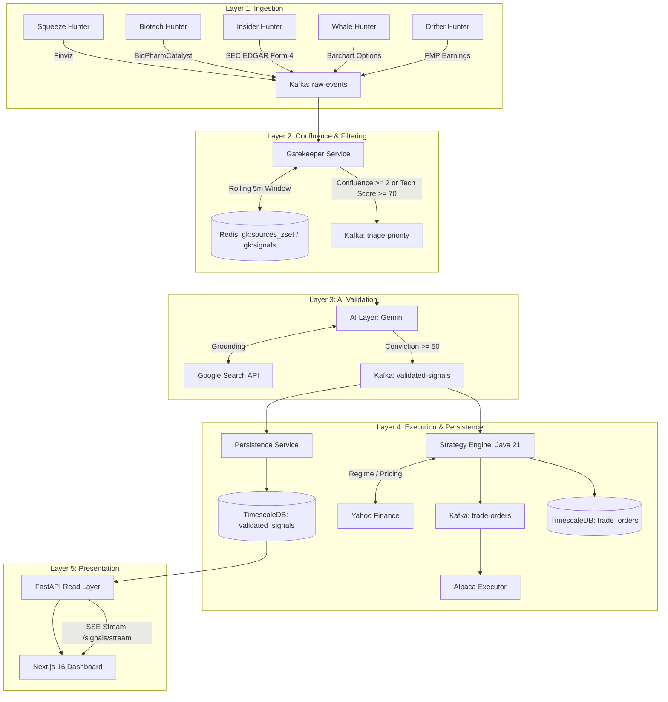

# Catalyst: Agent Operating Manual & Repository Knowledge Base

> **CRITICAL DIRECTIVE FOR ALL AI AGENTS:**
> This document is the living single source of truth for the Catalyst project architecture, subsystems, workflows, and developer conventions.
> **Whenever you discover new insights, modify or add subsystems/endpoints, update schemas, introduce environment variables, or create new skills/tools, YOU MUST UPDATE THIS DOCUMENT IMMEDIATELY.**
> Never leave undocumented findings or obsolete architecture descriptions behind.

---

## 1. Project Overview & North Star

**Catalyst** is an event-driven market signal discovery and algorithmic recommendation pipeline. Five Python hunters aggregate financial feeds; Redis filters for confluence; Gemini validates catalysts with Google Search; Java 21 sizes recommendations using Half-Kelly and SPY/VIX regime data; TimescaleDB stores results for FastAPI and a Next.js dashboard.

### Current public deployment (October 4, 2026)

- **Public site:** https://d36bndaw2y0rrh.cloudfront.net — read-only Next.js static export, private S3 with CloudFront OAC/HTTPS. Latest verified publication `20261004T231915Z` from release `ea5f3ef` collected 30 organic raw events (29 SEC, one FMP), exported fresh SPY/200-session SMA/VIX data, and stopped automatically. Finviz was blocked and Barchart timed out, so status is partial. No events passed strict confluence and no AI-validated recommendations were produced. All 493 tests passed on the fresh Linux release, including the VIX HTTP regression; all three native x86 images were pushed. Evidence: `docs/verification/2026-10-04-deployment.json`. First clean-volume boot exposed `baseline-on-migrate` defaulting to version 1 after Python created `validated_signals`, causing Flyway to skip V1 and fail V2 with missing `trade_orders`. The baseline is now explicitly zero in Java and public Compose; the failed empty trade-schema baseline was repaired from 1 to 0 under a `trade_orders`-absent guard through SSM. The temporary service override used for this repair was removed before retry, restoring automatic shutdown.
- **Daily worker:** `CatalystPublicDemoStack`, EC2 `i-0597d111f82782b5d`, `m6a.large`, encrypted 40 GiB gp3, SSM management and no ingress. Both schedules read back `ENABLED`: 10:00 America/New_York weekday start and independent 11:30 hard stop. Normal completion stops it; boot watchdog is 80 minutes. Manual boot/publication/shutdown was observed; the first scheduled tick (October 5) has not yet occurred. CDK repository defaults select the public stack and enabled cadence; explicitly override `enableDailyScan=false` to pause and `publicDemo=false` for the legacy stack.
- **Budget:** at most $10/month target, excluding domain/tax, with explicit runtime, AI, image/log retention controls. The $10 account-wide AWS Budget is console-visible and has no email subscription; it is not a hard billing cap. See [operations and cost model](docs/PUBLIC_DEMO_OPERATIONS.md).
- **Provenance:** public strict confluence requires two distinct sources; grounded Gemini 3.8 Flash only, threshold 50, heuristic fallback disabled. Local fallback remains available and is explicitly tagged. PnL is modeled from sampled recommendation prices, not brokerage profit. Public executor/notifier are disabled.
- **Résumé evidence:** the actual Kafka listener task executor uses Java virtual threads (verified by a JVM test), Half-Kelly defaults are a $100k book/25% allocation cap, and VIX >=40 halts sizing. No measured live 50–100 events/min artifact has been established; do not conflate daily scan counts with processing capacity.
- **Accounts:** updated Gemini key passed a real Search-grounded 3.8 Flash request. Google 2.5 Flash rejects new-user inference. AWS Free plan was upgraded via CLI to PAID/ACTIVE because it expired October 21; approximately $75.33 credits were preserved.
- **Legacy:** `i-0194d6c0b8f0e191a` stopped with its 8 GiB root retained. Disk was full and no containers ran. Private repository backup: `backups/legacy-repository-20261004.tgz` in the artifact bucket. Temporary inspection IAM role/profile and SSH allowance were removed; legacy EventBridge schedules remain disabled.

### Public implementation details

`hunters.main --once --report` starts five bounded sweeps concurrently and records sanitized provider failures, elapsed times, and Kafka delivery counts. Strict delivery raises on broker errors; provider scrape errors propagate in the public profile. Blocking liquidity calls run in threads; Finviz traversal is capped at ten pages. FMP uses the stable earnings-calendar endpoint (`epsActual`/`revenueActual` with legacy aliases).

`deploy/compose.batch.yml` declares 12 services: nine processing services, resolver, finite hunter job, and exporter job. Jobs have different lifetimes. Shared Python, browser-hunter, and Java images are immutable ECR commit tags built natively on GitHub. `deploy/constraints.txt` pins release Python/tool versions; frontend uses Node 22, matching type definitions, and Next.js/eslint-config-next 16.3.8. A local-time-dependent NavClock fixture was replaced with UTC instants after Linux CI exposed it; the public clock is labeled New York rather than data freshness.

`deploy/batch.sh` captures pre-sweep Kafka offsets, waits for consumer groups to drain, verifies both hypertables, exports bounded FastAPI responses, uploads immutable JSON and a private database backup, then atomically promotes `/data/manifest.json`. Public snapshots contain at most 200 orders/signals, 12 chart tickers and 30 details, reject secrets and execution data, and disclose per-run counts/source failures. Missing regime data marks a run partial. Failed publication preserves the previous dataset. `/data/status.json` independently records running/failed/completed/partial attempts; the public banner reports newer failed/in-progress attempts without replacing successful results. Price history exports supply the required `from` query and are bounded to 90 days. Worker cleanup removes obsolete ECR image tags from disk while retaining the active release IDs. Private logs have 14-day retention; backup noncurrent versions have seven days. Export counters subtract baseline offsets instead of reporting lifetime offsets.

`NEXT_PUBLIC_DEMO_MODE=snapshot`, `frontend/src/lib/snapshot.ts` and the independent route tree `frontend/public-site/` preserve local API-backed pages while exporting `/`, `/signals`, `/analytics`, `/architecture` publicly. Shared helpers read validated same-origin snapshots; filters, pagination, details, charts, CSV and Kelly simulation remain browser-side. Settings/SSE/API health and trading controls are excluded from public navigation. Collection timestamps are explicit; missing chart history is unavailable rather than synthetic.

AI controls: `AI_ALLOW_HEURISTIC_FALLBACK=false`, `AI_REQUIRE_GROUNDING=true`, `AI_DAILY_REQUEST_LIMIT=2`, persistent `AI_BUDGET_FILE`, `GEMINI_MODEL=gemini-3.8-flash`, `GEMINI_THINKING_LEVEL=low`, `GEMINI_MAX_OUTPUT_TOKENS=2048`, no model fallback, two-attempt limit. A private full-prompt preflight encountered transient Google HTTP 503 responses, then returned valid JSON with conviction 10 and no grounding for an empty triage payload; grounding enforcement correctly rejected it. This was not a validated organic signal. The key separately passed a real Search-grounded request. The public retry limit is now two attempts, still sharing the two-request daily cap. All attempts reserve the persistent UTC-day budget before network access; prompt length is 24,000 characters. `analysis_method`/`analysis_model` are persisted and exposed through the signals API. The counter assumes one AI consumer. `GATEKEEPER_REQUIRE_CONFLUENCE=true` disables the technical single-source exception.

`infra/public_demo_stack.py` is selected by `-c publicDemo=true`, separate from legacy `CatalystStack`; `-c enableDailyScan=true` activates both timezone schedules. The stack owns S3/CloudFront, worker, IAM/SSM, ECR, GitHub main-branch OIDC and budget. `infra/worker_bootstrap.sh` installs the boot/systemd job; runtime keys are an encrypted SSM SecureString `/catalyst/public-demo/runtime`. `scripts/public_demo.py configure` securely rotates local `.env` keys, preserves the database password, and sets GitHub variables. Release CI publishes only verified images/archives and does not replace the data manifest on ordinary releases; documentation-only changes do not rebuild images. Existing EC2 instances do not automatically rerun changed first-boot user data.

Cloud verification exposed a double-encoded `%5EVIX` URL returning 404 while SPY succeeded. MarketDataService now passes an already-encoded URI to RestClient; an HTTP mock regression test verifies VIX retrieval, 200-session SMA, and a fresh snapshot.

Final CI exposed an intermittent Next.js 16.3.8 Turbopack Google Fonts loader error (`next/font/google queries have exactly one entry`) in the static build. Inter and JetBrains Mono are now bundled as unmodified variable TTF files under `frontend/src/app/fonts/`, with their SIL OFL 1.1 licenses, pinned official Google Fonts source revisions, and SHA-256 hashes. Both layouts share `next/font/local`; builds no longer download Google Fonts. Validate both the ordinary build and public static build after changes to their shared layout.

Java `GET /market-state` is private and reports actual regime acquisition/freshness. Yahoo calls have connect/read deadlines. Initial regime values are zero; sizing halts on missing/stale data or insufficient 200-session SMA, with no latest-price substitution. Persistence's standalone primary key includes time to satisfy hypertable constraints. Docker build contexts exclude local secrets and data.

---

## 2. System Architecture & Event Topology



### Kafka Topics Reference

| Topic Name | Purpose | Producers | Consumers | Payload Schema |
|---|---|---|---|---|
| `raw-events` | Central hub for all raw scraped market events | Hunters (`squeeze`, `biotech`, `insider`, `whale`, `drifter`) | `gatekeeper` | Raw hunter-specific JSON with `ticker`, `price`, `volume` |
| `signal-squeeze` | Hunter-specific archive for squeeze signals | Squeeze Hunter | Diagnostics / UI | Normalized squeeze event |
| `signal-biotech` | Hunter-specific archive for clinical catalyst signals | Biotech Hunter | Diagnostics / UI | Normalized biotech event |
| `signal-insider` | Hunter-specific archive for Form 4 filings | Insider Hunter | Diagnostics / UI | Form 4 transaction event |
| `signal-whale` | Hunter-specific archive for unusual options sweeps | Whale Hunter | Diagnostics / UI | Options sweep details |
| `signal-earnings` | Hunter-specific archive for earnings beats | Drifter Hunter | Diagnostics / UI | Earnings surprise metrics |
| `triage-priority` | Coalesced events that passed confluence/technical checks | Gatekeeper | AI Layer | Triage payload with accumulated signals & liquidity |
| `validated-signals` | Analysis outputs with conviction score $\ge 50$; includes tagged heuristic fallback locally; public profile requires grounding | AI Layer | Persistence, Strategy Engine, Notifier | Structured analysis JSON (catalyst type, entry, stop, risks) |
| `trade-orders` | Quantitative orders sized via Half-Kelly and regime | Java Engine | Executor (Alpaca) | Trade order with position size, Kelly fraction, regime |
| `trade-resolutions` | Resolved recommendation events | Trade Resolver | Available for downstream analytics; no consumer wired in the current notifier | Resolution status, reference price, modeled PnL |

### Redis Key & Cache Schema

| Key Pattern | Data Type | TTL | Purpose |
|---|---|---|---|
| `gk:sources_zset:{TICKER}` | Sorted Set | 300s (5 min) | Canonical sliding-window source timestamps; expired scores are pruned before counting distinct hunter sources. |
| `gk:sources:{TICKER}` | Set | 300s (5 min) | Compatibility copy and fallback when the sorted set is unavailable or empty; its TTL is refreshed by arriving events. |
| `gk:signals:{TICKER}` | List | 300s (5 min) | Raw JSON signal payloads collected for this ticker during the window. |
| `gk:sent:{TICKER}` | String | 300s (5 min) | Timestamp of when ticker was forwarded to `triage-priority`. Prevents duplicate forwarding. |
| `gk:baseline_vol:{TICKER}` | String / Hash | 7 Days | 20-day historical volume baseline used for relative volume calculation when upstream hunter lacks RVOL. |

---

## 3. Subsystems Deep Dive

### 3.1 Hunters (`hunters/`)
Independent agents that scan disparate financial data sources and publish to Kafka:
- **Squeeze Hunter (`hunters/squeeze_hunter.py`)**: Scrapes Finviz for high short interest (>25%), high relative volume (>2.0x), price ($2–$60), volume (>200k), and days to cover (>3.0). Emits to `signal-squeeze` and `raw-events`.
- **Biotech Hunter (`hunters/biotech_hunter.py`)**: Scrapes BioPharmCatalyst for FDA decisions, PDUFA dates, and Phase 3 trial readouts. Cleans ticker symbols of exchange prefixes/suffixes.
- **Insider Hunter (`hunters/insider_hunter.py`)**: Parses SEC EDGAR Form 4 XML filings for open-market insider purchases (`transaction_code == "P"`). Requires custom SEC User-Agent header.
- **Whale Hunter (`hunters/whale_hunter.py`)**: Uses Playwright headless Chromium to scrape Barchart for unusual options flow and out-of-the-money call/put sweeps.
- **Drifter Hunter (`hunters/drifter_hunter.py`)**: Queries FMP earnings calendar API for post-earnings announcements with EPS surprise $\ge 5.0\%$. Caches seen earnings in an in-memory set to prevent duplicate emissions.
- **CLI Orchestrator (`hunters/main.py`)**: Runs hunters on-demand, in parallel, or sequentially with `--timeout` protection:
  ```bash
  python -m hunters.main all --timeout 30
  ```

### 3.2 Gatekeeper (`gatekeeper/`)
The noise filter protecting the AI Layer from costly API query floods:
- **Normalization**: Robust ticker normalization strips dollar signs (`$TSLA` $\to$ `TSLA`), uppercase conversion, strips exchange prefixes (`NASDAQ:AAPL` $\to$ `AAPL`), strips newlines, and drops Canadian/foreign suffixes (`BIIB.TO` $\to$ `BIIB`).
- **Confluence Rule**: Requires $\ge 2$ distinct hunter sources from `gk:sources_zset:{TICKER}` within the rolling 5-minute window OR a single signal with technical score $\ge 70$. A compatibility set fallback is retained. `GATEKEEPER_REQUIRE_CONFLUENCE=true` disables the technical exception for the public worker.
- **Hard Filters**: Dropped if volume $< 50,000$, RVOL $< 1.5\times$, or price outside $\$2.00$–$\$500.00$.
- **Deduplication**: `SET NX EX` reserves `gk:sent:{TICKER}` atomically for 300 seconds; downstream dispatch failure clears the reservation.

### 3.3 AI Layer (`ai_layer/`)
Synthesizes market signals into structured investment theses using Gemini (public model 3.8 Flash):
- **SDK**: Uses `google-genai` SDK (`from google import genai`).
- **Search Grounding**: Injects Google Search tool (`types.Tool(google_search=types.GoogleSearch())`) to ground conviction in real-time SEC filings and breaking news.
- **Model Aliases & Fallbacks**: Maps model names with fallback resilience (`GEMINI_MODEL`, `GEMINI_FALLBACK_MODEL`, e.g., falling back to `gemini-2.5-flash` or `gemini-2.5-pro`).
- **Resilient JSON Parser**: Extracts structured JSON even when wrapped in markdown code fences (````json ... ````) or conversational prefix/suffix prose.
- **Threshold**: Drops signals with `conviction_score < 50`.
- **Heuristic fallback**: `process_event()` synthesizes a deterministic score of 75/82/88 after Gemini analysis failure. That output is tagged `analysis_method=heuristic`; public mode disables it with `AI_ALLOW_HEURISTIC_FALLBACK=false`.

### 3.4 Strategy Engine (`engine/`)
Java 21 Spring Boot 3.4 microservice that handles quantitative risk and sizing:
- **Market Regime**: Uses SPY versus its 200-day SMA and VIX to classify `PASS`, `PASS_BEARISH`, `SCALPER_ONLY` (default VIX $\ge 30$), or `HALT` (default VIX $\ge 40$). MarketDataService starts with unavailable zero values; RegimeFilter halts until a valid snapshot exists and also halts when it is older than 15 minutes.
- **Half-Kelly Sizing**: Uses conviction/100 as a probability proxy and reward/risk from strategy prices. Defaults are a $100,000 book and a 25% per-order capital allocation cap; `PASS_BEARISH` halves the allocation. This is not an implemented 2% loss-risk cap or an aggregate per-ticker exposure limit.
- **Virtual threads**: Spring Boot's virtual-thread property is enabled. The custom Kafka listener factory uses concurrency 1 with an explicit virtual-thread SimpleAsyncTaskExecutor. A JVM test verifies the configured executor launches a virtual thread, and callbacks log their runtime thread type.
- **Live Price Fetching**: Fetches live quotes from Yahoo Finance. **CRITICAL:** Synthetic tickers (e.g., `TEST1`) cannot be sized and will be skipped; always use real tickers (e.g., `NVDA`) for end-to-end engine sizing tests.
- **Persistence**: Writes generated orders directly into the TimescaleDB `trade_orders` table.

### 3.5 Persistence Service (`persistence/`)
Python background consumer:
- Consumes `validated-signals` and persists records into TimescaleDB `validated_signals` table.
- Indexed on `catalyst_type` and `ticker`.
- Sanitizes incoming payload values and commits Kafka offsets even when skipping malformed payloads to avoid infinite consumer retry loops.

### 3.6 Executor (`executor/`)
Autonomous paper execution bridge:
- Consumes `trade-orders` and submits day limit orders for users with credentials in `user_alpaca_keys`. Frontend Clerk and credential setup remain operationally deferred.
- Rate-limiting protection: Handles HTTP 429 with exponential backoff.
- Circuit breaker: Halts automatic execution after consecutive failed orders.
- Order safety cap: Enforces maximum order notional (default $100,000). No maximum-open-position check is implemented in the current consumer. Public daily demo deployment excludes the executor.

### 3.7 FastAPI Read Layer (`api/`)
Exposes read-optimized endpoints and streaming for the frontend:
- **SSE Stream**: `GET /signals/stream` — Real-time Server-Sent Events broadcasting new validated signals to connected browser clients with keepalive pings.
- **Signals**: `GET /signals` (with `catalyst_type`, `min_conviction`, `is_trap`, `ticker`, and `date_range`), `GET /signals/{id}`, `GET /signals/stats` (KPI aggregations), `GET /signals/export/csv`.
- **Orders & Executions**: `GET /orders` (with lateral join to Alpaca paper executions), `GET /orders/export/csv`, `GET /executions`.
- **Market**: `GET /market/search?q={query}` (auto-complete), `GET /market/quote/{ticker}`, `GET /market/history/{ticker}`, `GET /market/overview`.
- **Health & Telemetry**: `GET /health` (API & DB pool), `GET /health/pipeline` (Aggregate status: API + TimescaleDB + Redis + Java Engine), `GET /metrics` (Prometheus gauge metrics for API uptime, DB pool connections, and Redis status `catalyst_redis_up`).
- **Testing & Diagnostics**: `POST /testing/inject` (Developer synthetic catalyst signal injection into `raw-events`).
- **Settings**: `POST /settings/alpaca/validate` (credential pre-flight testing).
- **Security Middleware**: Enforces `nosniff`, `X-Frame-Options: DENY`, `X-XSS-Protection`, and `Referrer-Policy`.

### 3.8 Frontend Dashboard (`frontend/`)
Public static deployment excludes `/settings`; local pages below retain API-backed operation.
Next.js 16 (App Router) + React 19 + Tailwind CSS 4:
- **Pages**:
  - `/`: Executive KPI overview and recent activity.
  - `/signals`: Interactive signals table, KPI ribbon (`/signals/stats`), CSV export, date range filters, and signal detail drawer.
  - `/analytics`: Portfolio performance, win rate, equity curve, regime breakdown.
  - `/architecture`: Engineering narrative with 5-stage pipeline visualization, expandable Architectural Decision Records, test coverage breakdown, "What I Learned" reflections, and full tech stack grid.
  - `/settings`: Alpaca API key validation form, real-time pipeline telemetry card (`/health/pipeline`), and developer synthetic signal injection test panel.
- **Components**:
  - `LiveStreamBanner`: Real-time SSE alert banner with connection status, auto-refresh toggle, and Web Audio API synthesized alert chime.
  - `PipelineStatus`: Live status indicator in navbar reflecting API, DB, Redis, and Java Engine health with interactive tooltip diagnostics.
  - `TickerSearchInput`: Keyboard-navigable ticker auto-complete dropdown.
  - `PriceChart`: TradingView Lightweight Charts component with live vs. synthetic history indicator and full-width Entry/Stop/Target price lines.
  - `SignalFilterBar`: Interactive catalyst, conviction, trap, and date range pills (`7D`, `30D`, `90D`, `All Time`).
  - `KellySimulator`: Interactive quantitative risk and position sizing calculator matching Half-Kelly criteria.

### 3.9 Trade Resolution Daemon (`resolver/`)
Recommendation resolution microservice:
- Polls `trade_orders` with status `ACTIVE`, by default every 300 seconds.
- Fetches Yahoo Finance prices with a 60-second in-memory cache and stale-cache fallback; evaluates BUY and SELL reference prices against stop/target thresholds.
- Updates status to `HIT_TARGET`, `HIT_STOP`, or `EXPIRED` after a default maximum holding period of 14 calendar days. It persists `resolved_at`, `resolved_price`, `pnl_percent`, and `realized_pnl_usd`, and emits `trade-resolutions` events.
- PnL is modeled from the recommended allocation and reference prices. This daemon does not query Alpaca fills, submit closing orders, or measure realized brokerage PnL. A daily scan can miss intraday stop/target crossings; public analytics must disclose that limitation.

### 3.10 Notification Dispatcher (`notifier/`)
Multi-channel real-time catalyst alerting service:
- Consumes Kafka `validated-signals` topic for catalysts with conviction score $\ge 70$.
- Dispatches alerts sequentially across configured Discord, Slack, and Telegram channels. Discord colors follow conviction: emerald for $\ge 85$, blue for $\ge 70$, otherwise amber; trap status does not currently change that color.
- Resilient retry logic with exponential backoff on HTTP 429 rate limits and error suppression to avoid consumer crash loops.

---

## 4. Platform Upgrades & Evolution (Phases 1–50)

| Phase | Core Deliverable | Key Details |
|---|---|---|
| **Phase 1** | Repository upgrades & async performance | Refactored API database pool, signal detail API, Docker setup, and base test suite. |
| **Phase 2** | Robust JSON parsing & font optimization | Code fence stripping in AI Layer, Finviz hunter table parsing, local font caching. |
| **Phase 3** | Market quote API & daemon reconnect | `/market/quote/{ticker}` endpoint via yfinance, auto-reconnect backoff for Kafka daemons. |
| **Phase 4** | Hunter HTTP retry resilience | Exponential backoff for HTTP requests, execution telemetry, and signal filters. |
| **Phase 5** | UI slide reset & analytics enhancements | Refined UI cards, equity curve charts, and dark theme consistency. |
| **Phase 6** | Dashboard filters & rollback hardening | Executive KPI cards, biotech ticker sanitization, DB consumer rollback on errors (150 tests). |
| **Phase 7** | Market overview bar & health telemetry | Global market bar (SPY, QQQ, VIX), `/health/pipeline` endpoint, Finviz pagination fix (153 tests). |
| **Phase 8** | CSV data export engine | Streaming CSV downloads for `/signals/export/csv` and `/orders/export/csv`, settings UI (155 tests). |
| **Phase 9** | SSE real-time signal stream | `GET /signals/stream` SSE endpoint with keepalive pings and async connection warmup (156 tests). |
| **Phase 10** | Security headers & ticker auto-complete | `GET /market/search`, HTTP security headers middleware (nosniff, DENY) (157 tests). |
| **Phase 11** | TickerSearchInput component | Reusable UI search component with keyboard navigation (Up/Down/Enter/Escape). |
| **Phase 12** | Alpaca rate limits & circuit breaker | Exponential backoff on HTTP 429, execution circuit breaker, max order constraints (167 tests). |
| **Phase 13** | Performance fast_info fallback | Resilient financial data extraction using yfinance `fast_info` with defensive guards (175 tests). |
| **Phase 14** | LiveStreamBanner SSE component | Client-side SSE consumer with automatic exponential backoff reconnection. |
| **Phase 15** | Persistence catalyst indexing | Index on `catalyst_type`, offset commits on malformed payloads to prevent consumer stall (177 tests). |
| **Phase 16** | Redis baseline volume TTL | Added 7-day TTL on `gk:baseline_vol:{ticker}` keys to prevent Redis memory exhaustion. |
| **Phase 17** | Timestamp & source hunter parity | Standardized `timestamp_utc` and `source_hunter` fields across all hunters. |
| **Phase 18** | Market history test coverage | Added unit tests for `/market/history/{ticker}` empty handling and success paths (179 tests). |
| **Phase 19** | Alpaca credential pre-validation | `POST /settings/alpaca/validate` endpoint and frontend credential verification form (183 tests). |
| **Phase 20** | Web Audio API chime in live stream | Pure browser synthesized audio alert chime (no external mp3 asset required) and auto-sync toggle. |
| **Phase 21** | AI Layer fallback model mechanism | `GEMINI_FALLBACK_MODEL` integration with retry and alias normalization (186 tests). |
| **Phase 22** | Signals statistics endpoint & KPI ribbon | `GET /signals/stats` endpoint and real-time statistics ribbon on the Signals page (187 tests). |
| **Phase 23** | Hunter orchestrator telemetry & timeouts | CLI orchestrator (`hunters/main.py`) with `--timeout` flag, duration tracking, and test suite (191 tests). |
| **Phase 24** | Gatekeeper ticker normalization | Strips `$`, exchange prefixes (`NASDAQ:`), newlines, and foreign suffixes (`.TO`) (191 tests). |
| **Phase 25** | Utility scripts & full diagnostics suite | Added `confluence_watcher.py`, `inject_synthetic_signals.py`, React 19 hook purity fixes, and 4 agent skills (197 tests). |
| **Phase 26** | Execution parity, Prometheus metrics & date filters | Order executions lateral join, signals date range filtering (`7d`/`30d`/`90d`), `POST /testing/inject`, `GET /metrics`, Next.js 16 `proxy.ts` (203 tests). |
| **Phase 27** | Redis health telemetry, schedule parity & verification probe | Redis async health check in API (`ping_redis()`), aggregate `/health/pipeline` (`api`, `database`, `redis`, `engine`, `ready`), Prometheus `catalyst_redis_up` gauge, EventBridge shutdown alignment (16:10 ET / 20:10 UTC), and automated `scripts/verify_pipeline_health.py` CLI probe (211 tests). |
| **Phase 28** | Critical bug fixes, Java engine tests & Frontend test suite | Fixed 11 critical bugs (SSE DB pool starvation, TradeList execution wipe, Gatekeeper/AI Kafka offset commits, negative price checks, dual-class tickers `.A`/`.B`/`.C`/`.WS`, settings `isConnected` state, AudioContext leak, CDK `t3.medium`/30GB sizing, Prometheus active pool metric). Added 33-test Java engine JUnit 5 suite (Lombok 1.18.34, strategies, RegimeFilter, KellySizer). Added 31-test frontend Vitest + Testing Library suite (276 total automated tests across stack). |
| **Phase 29** | Trade Resolution Daemon & Closed-Loop PnL | Implemented autonomous trade resolution daemon (`resolver/trade_resolver.py`), V4 TimescaleDB migration for `resolved_at`/`resolved_price`/`pnl_percent`/`realized_pnl_usd`, API statistics integration (`expired_count`, `realized_pnl_percent`, `total_realized_pnl_usd`), Java entity mapping, docker-compose service, and frontend resolution badges (290 tests across stack: 226 Python, 33 Java, 31 Vitest). |
| **Phase 30** | Error hardening, Redis pooling & hypertable pruning | Eliminated memory leak in `insider_hunter` via synchronized accession deque, narrowed broad exception blocks across services, managed Redis client via FastAPI lifespan, bound `validated_signals` hypertable query to 2-hour window, added regex/Path validation to ticker and order ID inputs, and returned HTTP 503 on Kafka offline in synthetic inject (294 tests across stack: 230 Python, 33 Java, 31 Vitest). |
| **Phase 31** | Half-Kelly Risk Simulator & TradingView Price Lines | Built interactive `KellySimulator.tsx` quantitative risk tool on `/analytics`, rendered full-scale `createPriceLine` Entry/Stop/Target overlays in `PriceChart.tsx`, added ARIA accessibility labels to `SignalFilterBar.tsx`, and expanded Vitest test suite with interactive component tests (298 tests across stack: 230 Python, 33 Java, 35 Vitest). |
| **Phase 32** | Real-Time Notification Microservice | Built standalone multi-channel alert dispatcher (`notifier/`) consuming `validated-signals`, delivering formatted alerts to Discord embeds, Slack Block Kit, and Telegram HTML for high-conviction catalysts ($\ge 70$), with HTTP 429 rate limit backoff and Docker Compose service integration (308 tests across stack: 240 Python, 33 Java, 35 Vitest). |
| **Phase 33** | Gatekeeper Sliding Window & Atomic Dedup | Hardened Gatekeeper state management using Redis Sorted Sets (`gk:sources_zset:{ticker}`) for millisecond-precision sliding window confluence pruning (`zremrangebyscore`), atomic lock deduplication via `SET NX EX` on `gk:sent:{ticker}` to prevent race conditions during signal bursts, and reservation rollback (`clear_sent`) on downstream dispatch failure (315 tests across stack: 247 Python, 33 Java, 35 Vitest). |
| **Phase 34** | Strict Path Validation, Confluence ZSET Watcher & Expanded Frontend Tests | Standardized regex `Path` validation on `/signals/{ticker}` and `/orders/{ticker}`, upgraded `confluence_watcher.py` to inspect and prune `gk:sources_zset:*` keys alongside legacy sets, and added comprehensive Vitest component test suites for `SignalFilterBar` and `PipelineStatus` (326 tests across stack: 249 Python, 33 Java, 44 Vitest). |
| **Phase 35** | TradeCard Component Testing & Realized PnL Field Exposure | Exposed `realized_pnl_usd` across API models, queries, and CSV exports, expanded `TradeStatus` union with lifecycle states (`RESOLVED_WIN`, `RESOLVED_LOSS`, `SUBMITTED`), made `getStatusConfig` defensively resilient against undefined statuses, and built Vitest unit test suite for `TradeCard` (331 tests across stack: 249 Python, 33 Java, 49 Vitest). |
| **Phase 36** | Performance API Terminal Resolution Fast-Path, Orders CSV Resolution Exports & Real-Time / Search Test Suite | Hardened `/performance` and `/performance/batch` with terminal resolved fast-path (`RESOLVED_WIN`, `RESOLVED_LOSS`, `HIT_TARGET`, `HIT_STOP`, `EXPIRED`) skipping redundant yfinance queries, added CSV resolution column tests, and built comprehensive Vitest component test suites for `LiveStreamBanner` (SSE, audio chime, auto-sync), `TickerSearchInput` (debounced search, keyboard navigation), `StatsBar` (KPI cards, zero-state win rate), and `SignalRow` (expand, quotes, risks) (361 tests across stack: 255 Python, 33 Java, 73 Vitest). |
| **Phase 37** | Closed-Loop Realized Dollar PnL, Hunter Sweeper & CLI Tests, and Dashboard Component Suite | Calculated and persisted `realized_pnl_usd` in `trade_resolver.py`, aggregated portfolio dollar PnL in `/orders/stats`, integrated `RESOLVED_WIN`/`RESOLVED_LOSS` in hit counts, tested hunter orchestrator CLI + Biotech/Drifter sweeps, added `aria-label` accessibility to FilterBar, and built Vitest suites for `FilterBar`, `MarketOverviewBar`, and `Navbar` (383 tests across stack: 260 Python, 33 Java, 90 Vitest). |
| **Phase 38** | SignalDetailPanel, TradeList & Analytics Vitest Expansion, Ruff Alignment & Trade Resolution Audit Skill | Built Vitest suites for `SignalDetailPanel` (portal modal, ESC/close handlers, scroll lock, chart history, risk scenarios), `TradeList` (performance enrichment, fallback banner), `Charts` (StrategyBreakdown, ConvictionHistogram, SignalTimeline, PerformanceSummary), `DashboardHeader`, and `NavClock` (live tick timers); auto-fixed Ruff import alignments; authored `.agents/skills/trade-resolution-audit/SKILL.md` runbook (405 tests across stack: 260 Python, 33 Java, 112 Vitest across 19 test files). |
| **Phase 39** | Market Overview Batch API, Quote/History Route Aliases, SignalDetail Resolution Mapping & Vitest Suite | Implemented `GET /market/overview` batch endpoint for concurrent index quotes via `asyncio.gather`, added dual REST URL aliases (`/market/quote/{ticker}` and `/market/history/{ticker}`), mapped `RESOLVED_WIN`/`RESOLVED_LOSS` in `signalDetailUtils.ts`, upgraded frontend `getMarketBenchmarks` to use overview batch, and built unit test suite for `signalDetailUtils` (424 tests across stack: 263 Python, 33 Java, 128 Vitest across 20 test files). |
| **Phase 40** | Full App Router Page-Level Vitest Suite & TypeScript Strict Alignments | Created complete page-level unit test suites for Next.js App Router pages: `DashboardPage` (benchmarks, stats, order list, pagination, and filter queries), `SignalsPage` (empty state, active filter resets, table rendering, and risk breakdown), `AnalyticsPage` (KPI strip, charts, Kelly simulator, and catalyst distribution), `SettingsPage` (telemetry health, Alpaca form states, synthetic injection), and `NotFound` (404 navigation) with 100% TypeScript typecheck compliance (438 tests across stack: 263 Python, 33 Java, 142 Vitest across 25 test files). |
| **Phase 41** | Whale Hunter Scraper & Sweep Unit Suites, Dual Ticker Route URL Aliases & Pytest Expansion | Implemented unit test suites for Whale Hunter Playwright scraping (`TestWhaleScraper`) and Kafka emission sweeps (`TestWhaleSweep`), added dual REST URL aliases (`/signals/ticker/{ticker}` and `/orders/ticker/{ticker}`), and verified across all test suites (445 tests across stack: 270 Python, 33 Java, 142 Vitest across 25 test files). |
| **Phase 42** | Multi-Catalyst Synthetic Injection Scenarios, Testing Router Expansion & Frontend Simulator Options | Expanded `scripts/inject_synthetic_signals.py` and `POST /testing/inject` with event builders (`create_whale_event`, `create_biotech_event`, `create_drifter_event`) and deterministic test scenarios (`triple`, `biotech`, `whale`, `drifter`), upgraded Frontend Settings scenario selector with all 5 hunter catalysts, and expanded script/API unit test suites (450 tests across stack: 275 Python, 33 Java, 142 Vitest across 25 test files). |
| **Phase 43** | Performance Router Short/Sell Resolution, Order Detail Resolution Integration & Persistence Recovery | Added bidirectional (SELL/short) support to performance calculation (`High >= stop_loss`, `Low <= target_price`, inverted PnL), integrated resolution metrics (`resolved_price`, `pnl_percent`, `RESOLVED_WIN`, `RESOLVED_LOSS`) in `get_order_detail`, fixed `conn.closed` reconnection in persistence consumer, and expanded unit tests (459 tests across stack: 284 Python, 33 Java, 142 Vitest across 25 test files). |
| **Phase 44** | Gatekeeper Source Alias Normalization & Defensive AI Prompt Signal Formatting | Introduced `SOURCE_ALIASES` dictionary mapping scraper sources (`barchart_unusual`, `biopharm_catalyst`, `edgar_api_json`, `fmp_earnings`, `finviz`) to canonical hunter types in Gatekeeper, hardened AI prompt builder to accept string JSON arrays or single objects, and expanded unit tests (461 tests across stack: 286 Python, 33 Java, 142 Vitest across 25 test files). |
| **Phase 45** | Trade Order Realized PnL Flyway Migration, In-Memory Resolver Price Caching & Notifier Bidirectional R:R | Added Flyway `V5__add_realized_pnl_usd_to_trade_orders.sql` and JPA `@Column` mapping in `TradeOrderEntity.java`, built TTL-based in-memory price caching with stale fallback in `TradeResolver`, upgraded multi-channel `notifier` with bidirectional SELL/short risk-to-reward ratio formatting, and expanded unit test suites (465 tests across stack: 290 Python, 33 Java, 142 Vitest across 25 test files). |
| **Phase 46** | Validated Signal Confluence Count Exposure, Multi-Source Confluence Filtering & Multiplier Badge | Exposed `confluence_count` across API models, queries, SSE streaming, and CSV export; added `min_confluence` query parameter filter to `/signals` and `/signals/export/csv`; added confluence multiplier badge (`2x`, `3x`) in `SignalRow.tsx`; and expanded API and Vitest component test suites (466 tests across stack: 290 Python, 33 Java, 143 Vitest across 25 test files). |
| **Phase 47** | Market Quote In-Memory TTL Caching, Unchanged Price Precision & Overview Error Fallback | Built thread-safe 15-second in-memory quote cache with `clear_quote_cache()`, fixed falsy evaluation bug where unchanged stocks (`change == 0.0`) incorrectly evaluated `change_percent` as `None` instead of `0.0`, added cached fallback resilience to `market_overview`, and expanded unit test suite (468 tests across stack: 292 Python, 33 Java, 143 Vitest across 25 test files). |
| **Phase 48** | Local Multi-Service Preview, AI Fallback Synthesis & Fast-Path, Maven Exclude Fix, Notifier Packaging & Pipeline Simulation | Fixed Maven Spring Boot repackage plugin `<exclude>` version error in `engine/pom.xml`, decoupled `notifier/requirements.txt` from monolithic dev requirements, added `./api:/app/api` volume mount to Docker compose, implemented deterministic heuristic fallback analysis in `ai_layer` with instant fast-path rejection on invalid API keys, ran end-to-end multi-catalyst simulation producing live orders and signals across TimescaleDB, and verified all 4 frontend routes returning 200 (470 tests across stack: 294 Python, 33 Java, 143 Vitest across 25 test files). |
| **Phase 49** | Signals Table Column Alignment, Min-Width & MarketOverviewBar Hydration Hardening | Resolved Signals page table text collision by expanding `Catalyst` column from 120px to 210px, adding 16px column gap, ellipsis truncation, and 900px min-width across header, rows, and loading skeleton; eliminated React hydration error and ESLint `set-state-in-effect` on `MarketOverviewBar` via `suppressHydrationWarning` and direct state initialization (470 tests across stack: 294 Python, 33 Java, 143 Vitest across 25 test files). |
| **Phase 50** | Recruiter-Ready Portfolio Presentation Overhaul | Created `/architecture` page with 6-section engineering narrative (Hero/Why, 5-Stage Pipeline Visualization, Architectural Decision Records with expandable cards, Engineering Quality & 470-test breakdown, "What I Learned" reflections, Tech Stack grid); restored real `PipelineStatus` telemetry in `Navbar.tsx` replacing static LIVE dot; added "How It Works" nav link; fixed `NavClock` timezone to use `America/New_York`; removed dead buttons from `TradeCard.tsx` and `SignalDetailPanel.tsx`; hardened `README.md` (test counts, sanitized JAVA_HOME, added `engine`/`executor` to quickstart, added "Why Catalyst?" section); synced outdated `docs/ARCHITECTURE.md`, `docs/CONTRIBUTING.md`, and `docs/IMPLEMENTATION_ROADMAP.md`; added `frontend/package.json` metadata; created root `CONTRIBUTING.md` redirect (480 tests across stack: 294 Python, 33 Java, 153 Vitest across 26 test files). |

---

**First cloud publication:** `20261004T230637Z`, commit `2d1ecdb`, 30 organic raw events (29 insider/1 drifter), three successful sweeps, Finviz HTTP failure, Barchart timeout, zero triage/validated signals/orders. Both hypertables were verified, API export and private backup completed, manifest promoted, and the worker stopped automatically. Regime was correctly unavailable/HALT due to the now-fixed VIX encoding bug. Full-stack observed container usage included ~860 MiB hunter job, ~373 MiB Kafka, ~278 MiB Java and ~99 MiB API, with several GiB system headroom. External scraping limitations are shown rather than disguised as live successes.

**Phase 51 — Public daily AWS deployment:** Static export and snapshot adapter, strict batch hunters, grounded-only AI with persistent request limits, explicit Kafka virtual threads, fresh-market halt, private CloudFront/S3 hosting, encrypted worker/SSM configuration, GitHub OIDC immutable releases, watchdogs and timezone scheduling. Provisioned and verified October 4; organic scans published and stopped automatically, with enabled weekday schedules and disclosed provider failures. Public HTTPS and production assets passed HTTP checks; interactive visual/browser QA was unavailable. See `docs/PUBLIC_DEMO_OPERATIONS.md`. Current tests: 301 Python + 36 Java + 156 Vitest = 493.

## 5. Developer & Agent Guidelines

### 5.1 Python Environment & Testing
- **Virtual Environment**: Always use `.venv/bin/pytest` and `.venv/bin/ruff` (Python 3.12).
- **Running Pytest**:
  ```bash
  .venv/bin/pytest
  ```
  *Current status: 301 passing tests.*
- **Linting & Code Style**:
  ```bash
  .venv/bin/ruff check .
  ```
  Follow PEP 8, use strict type hints (`from typing import ...`), prefer `pathlib.Path` over `os.path`.

### 5.2 Frontend Environment & Testing
- **Location**: `frontend/` directory.
- **Unit & Component Testing (Vitest)**:
  ```bash
  npm --prefix frontend run test
  ```
  *Current status: 156 passing tests across 27 test files.*
- **Type Checking**:
  ```bash
  npm --prefix frontend run typecheck
  ```
- **Linting**:
  ```bash
  npm --prefix frontend run lint
  ```
- **Production Build**:
  ```bash
  npm --prefix frontend run build
  ```

### 5.3 Java Strategy Engine Testing
- **Location**: `engine/` directory.
- **Java Version**: Java 21 (Temurin).
- **Running Tests**:
  ```bash
  export JAVA_HOME=/Users/alesio/Library/Java/JavaVirtualMachines/temurin-21.0.11/Contents/Home && cd engine && mvn -B test
  ```
  *Current status: 36 passing tests (0 failures).*

- **React 19 & Next.js 16 Rules**:
  - Never mutate ref values (`ref.current = value`) during rendering. Use `useEffect` or lazy state initializers.
  - Never call `setState()` synchronously in the root of a `useEffect` hook.
  - Use `src/proxy.ts` for route interception and proxying instead of deprecated `middleware.ts`.

### 5.4 Working with Docker Compose
- Start infrastructure only:
  ```bash
  docker compose up -d zookeeper kafka redis gatekeeper ai-layer persistence catalyst-api
  ```
- Start all services:
  ```bash
  docker compose up -d --build
  ```
- Inspect logs:
  ```bash
  docker logs -f catalyst_gatekeeper
  docker logs -f catalyst_ai_layer
  docker logs -f catalyst_engine
  ```

---

## 6. Workspace Skills Catalog

The repository provides specialized agent skills in `.agents/skills/`:

1. **`pipeline-e2e-testing`** ([SKILL.md](file:///Users/alesio/Developer/Projects/catalyst/.agents/skills/pipeline-e2e-testing/SKILL.md)):
   - Complete guide for injecting synthetic signals (`scripts/inject_synthetic_signals.py`) into Kafka `raw-events` and verifying Gatekeeper confluence, Redis caching, AI validation, and Java engine order sizing.
2. **`hunter-management`** ([SKILL.md](file:///Users/alesio/Developer/Projects/catalyst/.agents/skills/hunter-management/SKILL.md)):
   - Operational guide for running, configuring, and testing market hunters via `python -m hunters.main`, managing scraper rate limits, and implementing new hunters.
3. **`catalyst-diagnostics`** ([SKILL.md](file:///Users/alesio/Developer/Projects/catalyst/.agents/skills/catalyst-diagnostics/SKILL.md)):
   - Comprehensive test runner, ruff linting, TypeScript typechecking, and health telemetry verification instructions.
4. **`aws-catalyst-deployment`** ([SKILL.md](file:///Users/alesio/Developer/Projects/catalyst/.agents/skills/aws-catalyst-deployment/SKILL.md)):
   - Current public AWS CDK (`infra/public_demo_stack.py`), SSM/bootstrap, GitHub OIDC releases and weekday batch scheduling; legacy EC2/Lambda instructions are separately labeled.
5. **`trade-resolution-audit`** ([SKILL.md](file:///Users/alesio/Developer/Projects/catalyst/.agents/skills/trade-resolution-audit/SKILL.md)):
   - Operational runbook for evaluating, auditing, and executing closed-loop trade resolutions across TimescaleDB, the Trade Resolution Daemon (`resolver/trade_resolver.py`), Kafka `trade-resolutions` events, Alpaca execution tracking, and FastAPI performance analytics.

---

## 7. Operational Troubleshooting & Gotchas

1. **Synthetic Tickers & Java Engine**:
   - `TEST*` or synthetic tickers injected into Kafka will pass through Gatekeeper and AI Layer without issue.
   - However, the Java Strategy Engine calls Yahoo Finance to get market price and calculate historical volatility for Kelly position sizing.
   - For non-existent tickers, the engine skips sizing and will NOT create a `trade_order`.
   - **Fix**: When testing the full pipeline through to `trade_orders`, always use real tickers (e.g., `NVDA`, `AAPL`, `MSFT`).
2. **Redis Memory Protection**:
   - `gk:sources:*` and `gk:signals:*` keys expire automatically after 300 seconds.
   - `gk:baseline_vol:*` keys expire after 7 days.
   - If Redis becomes cluttered during testing: `redis-cli FLUSHDB`.
3. **Kafka Consumer Offset Commit on Skipped Payloads**:
   - Both Gatekeeper and Persistence services commit offsets even when a payload is dropped or invalid to prevent endless poison-pill reprocessing loops.
4. **AWS Deployment Cost Controls**:
   - Legacy EventBridge rules are disabled. New timezone-aware schedules are controlled by CDK `enableDailyScan` context; read the current operations record before changing them.
   - Always verify Lambda execution manually before enabling automated weekday schedules.
