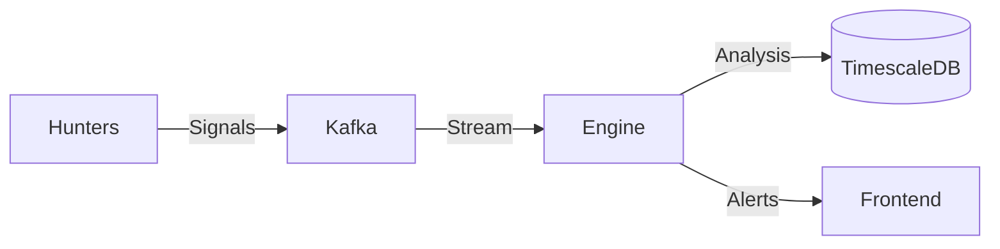

# Catalyst
**Automated Alpha Discovery Engine**

Catalyst is a modular, event-driven trading intelligence system designed to autonomously hunt for market anomalies, analyze financial data, and generate high-probability trading signals.

## 🚀 Mission
To democratize institutional-grade market analysis by combining:
1.  **Multi-Source Data Ingestion** ("Hunters")
2.  **Real-Time Event Processing** ("Kafka")
3.  **Algorithmic Strategy Execution** ("Engine")
4.  **Unified Visualization** ("Frontend")

## 🏗 Architecture

The system follows a microservices architecture powered by **Docker** and **Kafka**.



### 1. `hunters/` (The Eyes)
Independent Python agents that scour the web for raw data and market signals.
- **Squeeze Hunter**: Detects high short interest & mechanically primed stocks (Finviz).
- **Insider Hunter**: Tracks C-suite buying/selling activity.
- **Whale Hunter**: Monitors large block trades and unusual options volume.
- **News Hunter**: Sentiment analysis on breaking financial news.

### 2. `kafka/` (The Nervous System)
The central messaging backbone. Decouples data collection from analysis, allowing hunters to run asynchronously and scale indefinitely.
- **Broker**: Confluent Kafka
- **Topics**: `signal-squeeze`, `signal-insider`, `signal-whale`, etc.

### 3. `engine/` (The Brain)
*Coming Soon*. The core analysis unit (Java/Python) that:
- Consumes raw signals from Kafka.
- Backtests against historical data.
- Filters noise using technical validation (RSI, MACD, Volume Profile).
- Exposes an API for the frontend.

### 4. `frontend/` (The Face)
*Coming Soon*. A modern web dashboard to visualize:
- Live signal feeds.
- Strategy performance metrics.
- Real-time charts and alerts.

## 🛠 Quick Start

### Prerequisites
- Docker & Docker Compose
- Python 3.11+ (for local development)

### Running the System
Spin up the entire stack (Hunters, Kafka, DB, Redis):

```bash
docker-compose up --build -d
```

### Verification
Check if the Squeeze Hunter is finding targets:
```bash
docker logs -f hunter_squeeze
```

## 📦 Tech Stack
- **Ingestion**: Python, Playwright, Pandas
- **Messaging**: Apache Kafka, Zookeeper
- **Storage**: TimescaleDB (PostgreSQL), Redis
- **Infrastructure**: Docker, Docker Compose
