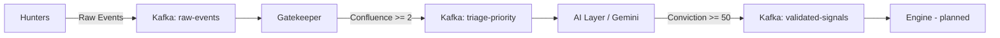

# Catalyst

**Market Signal Discovery Pipeline**

Catalyst discovers market catalysts by aggregating signals from multiple sources, validating them with LLMs, and ranking by conviction. It demonstrates event-driven architecture (Kafka), stateful aggregation (Redis), and LLM integration with search grounding—useful concepts for data pipelines, signal filtering, and AI-assisted analysis.

---

## What Actually Works

| Component | Status | Notes |
|-----------|--------|-------|
| **Squeeze Hunter** | ✅ Fully working | Finviz scrape → Kafka. Pre-emission filters (price, volume, short float). |
| **Gatekeeper** | ✅ Fully working | Redis 5-min window, confluence ≥ 2, hard filters (volume, price). |
| **AI Layer** | ✅ Fully working | Gemini + Search grounding, structured JSON output, conviction threshold. |
| **End-to-end pipeline** | ✅ Verified | Squeeze → Gatekeeper → AI → validated-signals. Tested with synthetic events. |
| **Insider Hunter** | ⚠️ Partial | Emits to Kafka; rarely passes Gatekeeper (lacks liquidity fields). |
| **Biotech Hunter** | ⚠️ Partial | Emits to Kafka; rarely passes Gatekeeper (lacks liquidity fields). |
| **Whale / Drifter / Shadow** | 📋 Stubs | Not implemented. Need data source research. |
| **Persistence** | ❌ Not built | Signals live in Kafka only. TimescaleDB wired in compose but unused. |
| **Frontend / Engine** | ❌ Not built | Designed, not implemented. |

*See [Components](#components) for details on each hunter and the pipeline.*

---

## Architecture


```mermaid
graph LR
    H[Hunters] -->|Raw Events| K[Kafka: raw-events]
    K --> G[Gatekeeper]
    G -->|Confluence >= 2| T[Kafka: triage-priority]
    T --> A[AI Layer / Gemini]
    A -->|Conviction >= 50| V[Kafka: validated-signals]
    V --> E[Engine - planned]
```

### Why This Architecture

| Technology | Why | Trade-off |
|------------|-----|-----------|
| **Kafka** | Decouples hunters from downstream, buffers bursts, scales to multiple consumers. | Current load ~50–100 events/min—Kafka is overkill. Chose it to learn patterns and design for scale. |
| **Redis** | Rolling-window aggregation for confluence. Per-ticker state with TTL, fast lookups. | Fits the use case well. Could use in-memory if single process; Redis enables scaling. |
| **Gemini + Search** | Context-aware validation. Grounding adds real-time news/filings without separate APIs. | Proprietary, cost per token. Considered open-source LLMs; Gemini's search integration accelerated iteration. |
| **Docker Compose** | Simple local dev. All services run with one command. | No production deployment config; see [DEPLOYMENT.md](docs/DEPLOYMENT.md) for AWS. |

### Signal Flow

| Step | Service | Input | Output | Trigger |
|------|---------|-------|--------|---------|
| 1 | Hunters | — | `raw-events` | Scheduled scrape |
| 2 | Gatekeeper | `raw-events` | `triage-priority` | Confluence ≥ 2 within 5 min |
| 3 | AI Layer | `triage-priority` | `validated-signals` | Conviction ≥ 50 |
| 4 | Engine *(planned)* | `validated-signals` | `trade-orders` | Kelly sizing, regime filter |

---

## Quick Start

### Prerequisites

- Docker & Docker Compose
- `GEMINI_API_KEY` in `.env` (copy from `.env.example`)

### Start the stack

```bash
docker compose up --build -d
```

### Start infrastructure only (no hunters)

```bash
docker compose up -d zookeeper kafka redis gatekeeper ai-layer kafka-ui
```

### Run a hunter

```bash
docker compose up -d hunter-squeeze
docker logs -f hunter_squeeze
```

---

## Components

### Hunters (`hunters/`)

Independent Python agents that scrape data and publish to Kafka. Each publishes to its own topic and to `raw-events` for the Gatekeeper.

| Hunter | Source | Status | Signal Type |
|--------|--------|--------|-------------|
| **Squeeze** | Finviz | ✅ Active | High short interest + unusual volume |
| **Biotech** | BioPharmCatalyst | ⚠️ Active | Phase 3 / PDUFA / NDA / BLA |
| **Insider** | SEC EDGAR | ⚠️ Limited | Form 4 purchase filings |
| **Whale** | Barchart | Stub | Unusual options flow |
| **Drifter** | FMP API | Stub | Post-earnings beat |
| **Shadow** | Dark pool | Stub | Dark pool prints |

#### Squeeze Hunter Pre-Emission Filters

Only stocks that pass all five filters reach the Gatekeeper:

| Filter | Threshold |
|--------|-----------|
| Price | $2.00 – $60.00 |
| Volume | ≥ 200,000 shares |
| Relative volume | ≥ 2.0x average |
| Short float | ≥ 25% |
| Days to cover | ≥ 3.0 (when available) |

### Gatekeeper (`gatekeeper/`)

Filter layer between ingestion and AI. Prevents low-quality events from reaching Gemini.

- **Aggregation:** 5-minute rolling Redis window per ticker
- **Hard filters:** Volume ≥ 50k, relative volume ≥ 1.5x, price $2–$500
- **Trigger:** Forward to `triage-priority` when confluence ≥ 2 (two hunters saw same ticker)
- **Dedupe:** Suppress ticker for 5 min after forwarding

### AI Layer (`ai_layer/`)

Consumes `triage-priority`, calls Gemini with Google Search grounding, publishes to `validated-signals`.

- **Output:** Structured JSON—conviction score, catalyst type, trap detection, entry/stop, risks
- **Threshold:** Drop if conviction < 50

---

## End-to-End Testing

Inject synthetic events to verify the pipeline without live scrapers.

### 1. Confirm services are up

```bash
docker compose ps
docker logs catalyst_gatekeeper 2>&1 | grep "Listening"
docker logs catalyst_ai_layer 2>&1 | grep "Listening"
```

### 2. Single source (should buffer, not forward)

```bash
docker run --rm --network catalyst_default confluentinc/cp-kafka:7.5.0 bash -c "
echo '{\"hunter\":\"squeeze\",\"ticker\":\"TEST1\",\"price\":8.50,\"volume\":900000,\"relative_volume\":3.5,\"short_float\":28.4,\"days_to_cover\":4.8,\"timestamp\":\"2026-01-01T12:00:00\"}' \
  | kafka-console-producer --broker-list kafka:29092 --topic raw-events
"
docker logs catalyst_gatekeeper 2>&1 | grep TEST1
# Expected: Buffered TEST1 from squeeze without trigger (confluence=1)
```

### 3. Second source (triggers confluence)

```bash
docker run --rm --network catalyst_default confluentinc/cp-kafka:7.5.0 bash -c "
echo '{\"hunter\":\"insider\",\"ticker\":\"TEST1\",\"transaction_code\":\"P\",\"transaction_amount_usd\":750000,\"volume\":900000,\"relative_volume\":3.5,\"price\":8.50,\"source\":\"edgar_api_json\",\"timestamp\":\"2026-01-01T12:00:05\"}' \
  | kafka-console-producer --broker-list kafka:29092 --topic raw-events
"
docker logs catalyst_gatekeeper 2>&1 | grep TEST1
# Expected: Forwarded TEST1 to triage-priority (confluence=2)
```

### 4. Check AI layer output

```bash
docker logs catalyst_ai_layer 2>&1 | grep -E "TEST1|Published|Dropped"
docker run --rm --network catalyst_default confluentinc/cp-kafka:7.5.0 bash -c "
  kafka-console-consumer --bootstrap-server kafka:29092 \
    --topic validated-signals --from-beginning \
    --max-messages 20 --timeout-ms 5000
" 2>&1 | grep TEST1
```

### 5. Test drop (low volume)

```bash
docker run --rm --network catalyst_default confluentinc/cp-kafka:7.5.0 bash -c "
echo '{\"hunter\":\"squeeze\",\"ticker\":\"JUNK\",\"price\":3.50,\"volume\":10000,\"relative_volume\":1.2,\"short_float\":22.0,\"timestamp\":\"2026-01-01T12:01:00\"}' \
  | kafka-console-producer --broker-list kafka:29092 --topic raw-events
"
docker logs catalyst_gatekeeper 2>&1 | grep JUNK
# Expected: Dropped JUNK: volume 10000.0 below minimum 50000.0
```

---

## What I Learned

1. **Confluence is harder than it looks.** Many signals are retail momentum, not catalysts. Confluence helps (Squeeze + Insider = stronger) but false positives remain. Better filtering would need more signal types or feedback (e.g., "did this actually move?").

2. **LLMs need grounding.** Without search context, Gemini hallucinated news and sentiment. Enabling Google Search grounding fixed that—cost and latency increased. Treat LLMs as one layer, not the source of truth.

3. **Kafka was overkill initially.** For ~50 events/min, a simple queue would work. Chose Kafka to learn it and design for scale. Would start simpler next time and add Kafka when throughput justifies it.

4. **Testing the happy path isn't enough.** Bugs in failure paths (e.g., Kafka down, retry logic) only showed up under full E2E runs. Integration tests and failure-path coverage matter.

---

## Implementation Roadmap

For prioritized tasks, dependencies, and agent reference, see [docs/IMPLEMENTATION_ROADMAP.md](docs/IMPLEMENTATION_ROADMAP.md). Covers Phase 1 (bugs, tests, persistence), Phase 2 (Java engine, API, dashboard), and Phase 3 (Clerk auth, Alpaca paper trading).

## Deployment

For AWS deployment, cost estimates, and scaling considerations, see [docs/DEPLOYMENT.md](docs/DEPLOYMENT.md).

**TL;DR:** EC2 + Docker Compose + Lambda scheduling. Runs at 7 AM and 9:30 AM ET. ~$10–15/mo. ECS/MSK (~$200+/mo) is documented for when you need production.

---

## Monitoring

- **Kafka UI:** [http://localhost:8080](http://localhost:8080) — browse topics
- **RedisInsight:** [http://localhost:5540](http://localhost:5540) — inspect gatekeeper state
- **Logs:** `docker logs -f catalyst_gatekeeper` or `catalyst_ai_layer`

---

## Tech Stack

| Layer | Technology |
|-------|------------|
| Ingestion | Python 3.11, Playwright, Pandas, httpx |
| Messaging | Apache Kafka (Confluent), Zookeeper |
| State | Redis 7 |
| AI | Google Gemini (Flash/Pro) with Search grounding |
| Infrastructure | Docker, Docker Compose |

---

## Future Work

- **Whale / Drifter / Shadow hunters:** Implement or remove stubs
- **Insider / Biotech:** Add liquidity lookup or relax Gatekeeper for binary-event sources
- **Persistence:** Consumer that writes validated signals to TimescaleDB
- **Strategy engine:** Kelly sizing, regime filter, trade blueprints (Java Spring Boot planned)
- **Frontend:** Dashboard for live signals (Next.js planned)
