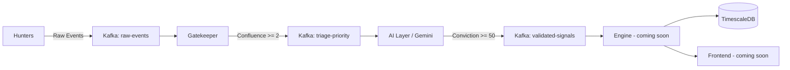

# Catalyst
**Automated Alpha Discovery Engine**

Catalyst is a modular, event-driven trading intelligence system designed to autonomously hunt for market anomalies, analyze financial data, and generate high-probability trading signals.

## Mission
To democratize institutional-grade market analysis by combining:
1. **Multi-Source Data Ingestion** ("Hunters")
2. **Real-Time Event Processing** ("Kafka")
3. **AI Signal Validation** ("Gemini + Google Search grounding")
4. **Algorithmic Strategy Execution** ("Engine")
5. **Unified Visualization** ("Frontend")

---

## Architecture

The system follows a microservices architecture powered by **Docker** and **Kafka**.


```mermaid
graph LR
    H[Hunters] -->|Raw Events| K[Kafka: raw-events]
    K --> G[Gatekeeper]
    G -->|Confluence >= 2| T[Kafka: triage-priority]
    T --> A[AI Layer / Gemini]
    A -->|Conviction >= 50| V[Kafka: validated-signals]
    V --> E[Engine - coming soon]
    E --> D[(TimescaleDB)]
    E --> F[Frontend - coming soon]
```

### Signal Flow

| Step | Service | Input Topic | Output Topic | Trigger |
|------|---------|-------------|--------------|---------|
| 1 | Hunters | — | `raw-events` | Scheduled scrape |
| 2 | Gatekeeper | `raw-events` | `triage-priority` | Confluence ≥ 2 sources within 5 min |
| 3 | AI Layer | `triage-priority` | `validated-signals` | Conviction score ≥ 50 |
| 4 | Engine *(coming soon)* | `validated-signals` | `trade-orders` | Kelly sizing + regime filter |

---

## Components

### 1. `hunters/` — The Eyes

Independent Python agents that scour the web for raw data and market signals. Each hunter publishes to its own topic (`signal-squeeze`, `signal-insider`, etc.) **and** to `raw-events` so the Gatekeeper sees all of them in one place.

| Hunter | Source | Status | Signal Type |
|--------|--------|--------|-------------|
| **Squeeze** | Finviz screener | Active | High short interest + unusual volume |
| **Biotech** | BioPharmCatalyst | Active | Phase 3 / PDUFA / NDA / BLA events |
| **Insider** | SEC EDGAR API | Stub (Apple only) | C-suite Form 4 purchase filings |
| **Whale** | Barchart options | TODO | Unusual options flow / block trades |
| **Drifter** | FMP earnings API | TODO | Post-earnings beat, swing setup |
| **Shadow** | Dark pool data | TODO | Dark pool prints and sentiment |

#### Squeeze Hunter Pre-Emission Filters

The squeeze hunter applies these filters before publishing anything to Kafka — only stocks that pass all five reach the Gatekeeper:

| Filter | Threshold |
|--------|-----------|
| Price range | $2.00 – $60.00 |
| Volume | ≥ 200,000 shares |
| Relative volume | ≥ 2.0x average |
| Short float | ≥ 25% |
| Days to cover | ≥ 3.0 (when available) |

---

### 2. `kafka/` — The Nervous System

The central messaging backbone. Decouples data collection from analysis, allowing hunters to run asynchronously and scale independently.

- **Broker**: Confluent Kafka
- **Topics**: `raw-events`, `triage-priority`, `validated-signals`, `signal-squeeze`, `signal-insider`, `signal-whale`, `signal-biotech`, `signal-earnings`, `signal-shadow`

---

### 2.5. `gatekeeper/` — The Sniper Scope

A filter layer that sits between ingestion and analysis to prevent "garbage in, garbage out."

- **Aggregation**: Holds raw signals in a 5-minute rolling Redis window per ticker
- **Hard Filters**: Drops events that fail liquidity and momentum thresholds before they enter the window
- **Trigger**: Forwards a ticker to `triage-priority` only when **Confluence ≥ 2** (two or more different hunters saw the same ticker within the window)
- **Dedupe**: Once a ticker is forwarded, it is suppressed for 5 minutes — prevents duplicate AI calls for the same setup

#### Gatekeeper Hard Filters

| Filter | Default | Env Var |
|--------|---------|---------|
| Minimum volume | 50,000 shares/day | `GATEKEEPER_MIN_VOLUME` |
| Minimum relative volume | 1.5x avg | `GATEKEEPER_MIN_RELATIVE_VOLUME` |
| Minimum price | $2.00 | `GATEKEEPER_MIN_PRICE` |
| Maximum price | $500.00 | `GATEKEEPER_MAX_PRICE` |

#### Redis Keys (per ticker, all TTL = 5 min)

| Key | Type | Contents |
|-----|------|----------|
| `gk:sources:{ticker}` | SET | Hunter names that have seen this ticker |
| `gk:signals:{ticker}` | LIST | Full signal payloads buffered in order |
| `gk:sent:{ticker}` | STRING | Dedupe flag — exists = already forwarded |
| `vol_baseline:{ticker}` | STRING | EMA volume baseline used by squeeze hunter |

---

### 3. `ai_layer/` — The Synthesizer

Consumes triage payloads from `triage-priority`, calls Gemini with Google Search grounding, and publishes validated structured signals to `validated-signals`.

- **Model**: Gemini Flash (configurable via `GEMINI_MODEL` env var)
- **Grounding**: Google Search enabled via the Gemini SDK — before scoring, Gemini autonomously searches for live news, recent filings, and relevant context for the ticker
- **Output**: Structured JSON — conviction score, catalyst type, trap detection, entry zone, stop level, key risks, rationale

#### Validated Signal Schema

| Field | Type | Description |
|-------|------|-------------|
| `conviction_score` | int 0–100 | Overall signal confidence |
| `catalyst_type` | string | SUPERNOVA / SCALPER / FOLLOWER / DRIFTER / UNKNOWN |
| `is_trap` | bool | True when signals conflict dangerously |
| `trap_reason` | string\|null | Explanation if is_trap is true |
| `rationale` | string | 1-2 sentence edge explanation |
| `news_sentiment` | string | bullish / bearish / neutral / unknown (grounded) |
| `risk_level` | string | low / medium / high / extreme |
| `suggested_timeframe` | string | scalp / intraday / swing |
| `suggested_entry_zone` | string | Price range or "no clear level" |
| `suggested_stop` | string | Stop logic or "no clear level" |
| `key_risks` | string[] | Specific risks for this setup |
| `raw_signals_summary` | string | One-sentence digest of hunter data |

#### Conviction Calibration

| Score | Meaning |
|-------|---------|
| 90–100 | Multiple confirming signals, no contradictions |
| 70–89 | Strong, most signals align |
| 50–69 | Moderate, single dominant signal |
| < 50 | Do not trade — dropped before `validated-signals` |
| < 40 | Required if `is_trap = true` |

---

### 4. `engine/` — The Strategist *(Coming Soon)*

The core execution unit (Java Spring Boot) that:
- Consumes validated signals from the AI layer
- Applies strict math, Kelly Criterion position sizing, and regime filters (VIX)
- Determines exit logic and micro-structure triggers for execution
- Exposes an API and publishes final trade blueprints to `trade-orders`

---

### 5. `frontend/` — The Face *(Coming Soon)*

A modern web dashboard to visualize:
- Live signal feeds with conviction scores
- Strategy performance metrics
- Real-time charts and alerts

---

## Quick Start

### Prerequisites
- Docker & Docker Compose
- A valid `GEMINI_API_KEY` in `.env` (copy `.env.example` to `.env`)

### Start the full stack

```bash
docker compose up --build -d
```

### Start only infrastructure + core pipeline (no hunters)

Useful for testing the Gatekeeper → AI layer flow without running live scrapers:

```bash
docker compose up -d zookeeper kafka redis gatekeeper ai-layer kafka-ui
```

### Start a specific hunter

```bash
docker compose up -d hunter-squeeze
docker compose up -d hunter-biotech
docker compose up -d hunter-insider
```

### Verify the squeeze hunter is finding targets

```bash
docker logs -f hunter_squeeze
```

---

## End-to-End Testing

Manual verification of the full pipeline without running live hunters. Inject synthetic events directly into Kafka and observe each layer respond.

### Step 1 — Confirm services are healthy

```bash
docker compose ps
```

Expected: `kafka`, `redis`, `gatekeeper`, `ai-layer` all show `Up`.

```bash
docker logs catalyst_gatekeeper 2>&1 | grep "Listening"
# Expected: Listening on raw-events and forwarding to triage-priority

docker logs catalyst_ai_layer 2>&1 | grep "Listening"
# Expected: Listening on triage-priority and publishing to validated-signals
```

### Step 2 — Inject a single-source signal (should buffer, not forward)

```bash
docker run --rm --network catalyst_default confluentinc/cp-kafka:7.5.0 bash -c "
echo '{\"hunter\":\"squeeze\",\"ticker\":\"TEST1\",\"price\":8.50,\"volume\":900000,\"relative_volume\":3.5,\"short_float\":28.4,\"days_to_cover\":4.8,\"timestamp\":\"2026-01-01T12:00:00\"}' \
  | kafka-console-producer --broker-list kafka:29092 --topic raw-events
"
```

Check gatekeeper log — it should show `Buffered TEST1 from squeeze without trigger (confluence=1, ...)`:

```bash
docker logs catalyst_gatekeeper 2>&1 | grep TEST1
```

### Step 3 — Inject a second signal for the same ticker (triggers confluence)

```bash
docker run --rm --network catalyst_default confluentinc/cp-kafka:7.5.0 bash -c "
echo '{\"hunter\":\"insider\",\"ticker\":\"TEST1\",\"transaction_code\":\"P\",\"transaction_amount_usd\":750000,\"volume\":900000,\"relative_volume\":3.5,\"price\":8.50,\"source\":\"edgar_api_json\",\"timestamp\":\"2026-01-01T12:00:05\"}' \
  | kafka-console-producer --broker-list kafka:29092 --topic raw-events
"
```

Check gatekeeper — should show `Forwarded TEST1 to triage-priority (confluence=2, ...)`:

```bash
docker logs catalyst_gatekeeper 2>&1 | grep TEST1
```

### Step 4 — Confirm the triage payload landed in Kafka

```bash
docker run --rm --network catalyst_default confluentinc/cp-kafka:7.5.0 bash -c "
  kafka-console-consumer --bootstrap-server kafka:29092 \
    --topic triage-priority --from-beginning \
    --max-messages 20 --timeout-ms 5000
" 2>&1 | grep TEST1
```

Expected: a JSON object with `ticker`, `confluence_count: 2`, `confluence_sources: ["insider","squeeze"]`, `signals` array, and `float_shares`/`market_cap` fields.

### Step 5 — Confirm the AI layer processed it

```bash
docker logs catalyst_ai_layer 2>&1 | grep -E "TEST1|Published|Dropped|Failed"
```

Expected outcome:
- `AFC is enabled` in the log — confirms Google Search grounding is active
- `Published validated signal for TEST1 with conviction XX` — signal passed
- OR `Dropped TEST1: conviction_score XX below threshold 50` — signal scored too low

### Step 6 — Read the validated signal

```bash
docker run --rm --network catalyst_default confluentinc/cp-kafka:7.5.0 bash -c "
  kafka-console-consumer --bootstrap-server kafka:29092 \
    --topic validated-signals --from-beginning \
    --max-messages 20 --timeout-ms 5000
" 2>&1 | grep TEST1
```

A passing signal will include all fields from the Validated Signal Schema above.

### Step 7 — Test a drop (low volume)

```bash
docker run --rm --network catalyst_default confluentinc/cp-kafka:7.5.0 bash -c "
echo '{\"hunter\":\"squeeze\",\"ticker\":\"JUNK\",\"price\":3.50,\"volume\":10000,\"relative_volume\":1.2,\"short_float\":22.0,\"timestamp\":\"2026-01-01T12:01:00\"}' \
  | kafka-console-producer --broker-list kafka:29092 --topic raw-events
"
```

```bash
docker logs catalyst_gatekeeper 2>&1 | grep JUNK
# Expected: Dropped JUNK: volume 10000.0 below minimum 50000.0
```

### Step 8 — Test a drop (price below floor)

```bash
docker run --rm --network catalyst_default confluentinc/cp-kafka:7.5.0 bash -c "
echo '{\"hunter\":\"squeeze\",\"ticker\":\"PENNI\",\"price\":0.85,\"volume\":500000,\"relative_volume\":3.0,\"short_float\":30.0,\"timestamp\":\"2026-01-01T12:02:00\"}' \
  | kafka-console-producer --broker-list kafka:29092 --topic raw-events
"
```

```bash
docker logs catalyst_gatekeeper 2>&1 | grep PENNI
# Expected: Dropped PENNI: price 0.85 below minimum 2.0
```

---

## Monitoring

### Kafka UI — visual topic browser
Open [http://localhost:8080](http://localhost:8080) — browse and inspect messages in any topic in real time.

### RedisInsight — visual Redis browser
Open [http://localhost:5540](http://localhost:5540) — inspect all gatekeeper state live.

### Live logs

```bash
# Watch gatekeeper decisions in real time
docker logs -f catalyst_gatekeeper

# Watch AI layer calls and conviction scores
docker logs -f catalyst_ai_layer

# Watch the squeeze hunter scraping
docker logs -f hunter_squeeze
```

---

## Tech Stack

| Layer | Technology |
|-------|-----------|
| Ingestion | Python 3.11, Playwright, Pandas, httpx |
| Messaging | Apache Kafka (Confluent), Zookeeper |
| Caching / State | Redis 7 |
| AI Analysis | Google Gemini (Flash / Pro) with Search grounding |
| Storage | TimescaleDB (PostgreSQL 16) |
| Infrastructure | Docker, Docker Compose |
