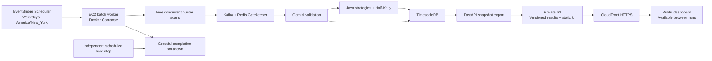

# Public demo: 24/7 dashboard, one weekday pipeline run

Assessment date: October 3, 2026. Status: evaluated and proposed; application changes and AWS publication have not been implemented.

## Accepted requirements

- Keep the public dashboard available 24/7 over HTTPS using an AWS-provided URL.
- Show the latest daily results with their actual collection time. The public experience is read-only.
- Run the existing Kafka/Python/Java pipeline once per weekday; continuous collection is unnecessary for this portfolio deployment.
- Target no more than $10/month for hosting, excluding domain registration. Also bound AI usage so the combined operating cost can stay near that budget.
- Use AWS CLI and CDK for setup, scheduling, publication, and remote operations. Keep the manual steps visible and reproducible.
- Preserve and substantiate the engineering described in the résumé. Distinguish operational cadence from measured processing capacity.

This target supersedes the market-hours operating cadence in the older deployment guides. It is not a statement that the new architecture has already been deployed.

## Recommended design

The public site should use the existing Next.js UI with a static export and a browser-side adapter for real, versioned JSON snapshots. Serve the exported assets and snapshots from a private S3 bucket through CloudFront with Origin Access Control. The default `*.cloudfront.net` address supplies HTTPS without a purchased domain or an Elastic IP.

Run the full data-processing chain on an x86 EC2 worker for a bounded weekday window. Retain Kafka, Redis, TimescaleDB, the five hunter services, Gatekeeper, Gemini, Java sizing, and the FastAPI read layer. Export the public snapshot through FastAPI after processing finishes, then stop the worker. FastAPI remains the database read API during each processing run; the public browser reads its published snapshot while that API is stopped.

Keep filters, pagination, analytics, signal details, price charts for exported tickers, CSV downloads, the Kelly simulator, and the architecture page. Adapt SSE and pipeline badges to show the last completed run and next scheduled scan. A stopped batch worker is expected operation, not a site outage. Quote timestamps must describe data acquisition, not the time someone opened the page.

Publish each snapshot under an immutable run ID. Upload and validate all its files before replacing the small manifest that points to the active run. Failed or incomplete runs must leave the previous successful dataset available and display stale-data status. Bound history size and keep a separate sanitized run report describing each hunter's result, event counts, consumer lag, model/provenance, duration, and snapshot publication status.

## Monthly cost model

Planning region: `us-east-1`. Assumptions: 22 weekday runs, no more than one hour per normal run, light portfolio traffic, 40 GiB gp3, and no paid market-data subscription. These are estimates, not a billing ceiling.

| Component | Planning cost per month | Basis |
|---|---:|---|
| EC2 `m6a.large`, 2 vCPU / 8 GiB | $1.90 | AWS Pricing API returned $0.0864/hour for Linux shared-tenancy On-Demand; 22 hours/month |
| Persistent 40 GiB gp3 disk | $3.20 | $0.08/GiB-month; billed even while EC2 is stopped |
| Worker public IPv4 | $0.11 | $0.005/hour during 22 running hours; auto-assigned address, no retained Elastic IP |
| S3 data and requests, CloudFront | $0.10–$0.25 allowance | Small datasets and light traffic; CloudFront pay-as-you-go includes a monthly account allowance |
| Logs, bounded backups, scheduling, parameter access | $0.50–$1.00 allowance | Short retention, small backups, no paid always-on control plane |
| **AWS subtotal** | **About $6–$6.50** | Excludes current legacy resources and taxes |
| Gemini | **$0–$2.50 target** | Requires an enforced daily request/token budget and eligible model/grounding pricing |
| **Expected combined operation** | **About $6–$9** | Leaves limited room for setup runs and occasional longer processing |

The worker size is a starting point for a measured memory check, not a demonstrated minimum. An 8 GiB non-burstable instance avoids making a multi-JVM/browser stack depend on 1 GiB RAM or T3 surplus-credit charges. If every run reaches the proposed 90-minute fail-safe, compute and IPv4 rise by roughly $1/month; repeated manual runs, oversized backups, AI retries, or paid feed access can exceed the budget.

Configure a $10 AWS Budget with forecast/actual notifications and tag the deployment. Budgets notify; they do not hard-cap the bill. Enforce the worker deadline, bound logs and backup retention, count AI retries against the daily allowance, and keep public traffic away from the processing API. Select a low-cost currently supported Gemini model and cap total output, including thinking, before activation. Existing code defaults/aliases must not silently switch a low-cost run to an expensive Pro model.

Price references checked during assessment: [EC2 On-Demand](https://aws.amazon.com/ec2/pricing/on-demand/), [EBS gp3](https://aws.amazon.com/ebs/pricing/), [public IPv4](https://aws.amazon.com/vpc/pricing/), [CloudFront monthly allowances](https://aws.amazon.com/cloudfront/faqs/), and [Gemini pricing](https://ai.google.dev/gemini-api/docs/pricing). The exact `m6a.large` rate was also read through `aws pricing get-products` with Linux, Shared tenancy, Used capacity, no preinstalled software, and US East (N. Virginia) filters.

## Existing AWS resources: read-only findings

- AWS CLI credentials work in `us-east-1`.
- `CatalystStack` is `CREATE_COMPLETE` and manages the start/stop functions and legacy schedules for an existing EC2 instance.
- Existing `catalyst` instance `i-0194d6c0b8f0e191a` was **running** when inspected. It is a `t3.micro`, with 1 GiB RAM and an 8 GiB unencrypted gp3 root disk.
- Both legacy EventBridge rules are disabled. Their deployed UTC schedules are startup 10:50 and shutdown 20:00 on weekdays; source code now specifies 20:10 for shutdown.
- The instance has no IAM instance profile. Systems Manager reports no managed instances in the region.
- Its security group allows SSH from one restricted IPv4 CIDR, with no public HTTP/HTTPS ingress.
- No Elastic IPs or CloudFront distributions were found. The bucket search found the CDK bootstrap bucket and no Catalyst hosting bucket.
- The existing CDK source's optional new-instance path provisions `t3.medium` / 30 GiB, while older documentation and the deployment skill describe `t3.micro` / 8 GiB. The current stack does not yet bootstrap the app or publish the site.

At the current `t3.micro` rate, 730 running hours plus public IPv4 and 8 GiB gp3 is approximately $11.90/month before credits, taxes, traffic, or CPU-credit charges. This legacy instance should be inspected and backed up before a reviewed stop/resize/migration decision. No instance was stopped, resized, terminated, or otherwise changed during this assessment. Keeping it running alongside the proposed worker invalidates the under-$10 estimate.

## Application and deployment gaps

| Area | What exists | Required before publication |
|---|---|---|
| Public frontend | `/`, `/signals`, and `/analytics` force dynamic server rendering; filters use server `searchParams`; API calls default to localhost | Add static export mode, browser snapshot loading, client filtering/pagination, and correct route handling at CloudFront. Account for the no-op Proxy and unused catch-all sign-in/sign-up routes, which cannot simply be exported as-is. |
| Snapshot content | FastAPI JSON and CSV endpoints exist | Create a bounded, sanitized exporter for orders, signals, stats, details, performance, benchmark quotes, relevant history, and a run manifest. Do not export credentials, account identifiers, or internal diagnostics. |
| Freshness and availability | SSE reconnects continuously; health badge marks a stopped API offline; market timestamp records page load | Add daily-run status, actual `as_of` timestamps, stale-data detection, and expected worker-offline state. Snapshot deployment must make no localhost requests. |
| Daily hunter execution | All five hunter `run()` methods loop; `--timeout` cancels them and reports failure | Add a genuine one-sweep execution mode with per-hunter outcomes, concurrent start, a whole-run deadline, and sensible handling of missing keys or source errors. A killed infinite loop is not a successful one-shot job. |
| Completion and restarts | Gatekeeper and AI commit offsets even after processing exceptions; Java publishes and persists separately | Capture consumer lag and per-stage failures; verify database writes before publishing success. Persist required data/offsets and make restart/publication idempotent. Do not infer success from a healthy process alone. |
| Database bootstrap | Flyway owns trade order migrations; Python owns validated signals | Run from a clean volume. `persistence/schema.sql` has an `id`-only primary key incompatible with a time-partitioned hypertable; the consumer's own DDL differs. Choose one consistent schema path and verify both tables are hypertables. |
| AI provenance and spend | Gemini retries/model fallback plus automatic heuristic synthesis | Persist and display the analysis method; label heuristic outputs explicitly or fail closed for the public grounded dataset. Enforce call/token caps, including retries. Local Gemini/FMP keys are present; their validity and entitlement were not checked. |
| Market-data validity | Engine preserves prior snapshots and begins with illustrative SPY/VIX values | Require a successfully fetched, acceptably fresh regime snapshot before calling a daily run validated. A provider outage must not produce a new result from the initial sample values. |
| Resolution analytics | Resolver evaluates `ACTIVE` recommendations against sampled Yahoo prices, defaults to 14 calendar days | Describe modeled recommendation PnL, not realized broker profit. Daily samples miss intraday stop/target crossings; do not imply continuous lifecycle monitoring in the public mode. |
| Public controls | Testing injection is unauthenticated; settings and trading controls are rendered | Exclude mutation controls, credential flows, and broker execution from public snapshot mode. Keep the processing API private to the worker. |
| Runtime packaging | Frontend Compose image runs `next dev`; app sources use bind mounts; multiple dependency/image tags float | Build immutable production images in CI for x86, reference a commit/digest, apply resource/log limits, and avoid compiling on every morning boot. Preserve the local development workflow. |
| Remote operation | Bootstrap script still needs SSH, manual `.env`, and manual Compose startup | Add Systems Manager role, declarative bootstrap/systemd batch service, Parameter Store secrets, CLI status/log commands, and a repeatable release process. |
| Scheduling and spend | UTC EventBridge rules stop the same instance that would serve the site | Use timezone-aware EventBridge Scheduler for the worker only. Add independent hard stop, short retry/late-start limits, graceful shutdown, and failure reporting. |
| CI | Three-language test workflow exists; no deployment workflow | Add frontend/data publication and image release using GitHub OIDC with scoped AWS roles. Current Python CI installs some service dependencies indirectly and its format checks need a fresh readiness result. |

[Next.js static exports](https://nextjs.org/docs/app/guides/static-exports) support static hosting, but features requiring a running server need adaptation. This proposal keeps Next.js and its existing UI; it is not a claim that adding `output: "export"` alone will make the current application deployable.

## Résumé claim audit

| Claim in the supplied résumé | Evidence in the current repo | Deployment action |
|---|---|---|
| Kafka, Java, Python, Docker, AWS | All present; AWS scheduling stack exists | Keep the processing chain on AWS in Docker and capture one actual AWS run with the deployed commit and service inventory. |
| 12 containerized services | Current `docker compose config --services` lists 20, including optional UIs/execution/notification | The original 12-service scope may be historical. Record the current worker profile's actual count; do not force the architecture to exactly 12 or claim all 20 run publicly. |
| Five concurrent scrapers | Five hunter Compose services and CLI `asyncio.gather` exist | Start genuine one-shot scans concurrently and save each source's success/failure, duration, and emitted count. External providers can return zero events or reject a request. |
| About 50–100 events/min | Appears in `docs/DOCS_DRAFT.md`; no measured throughput artifact found | Capture broker offsets and elapsed time during active runs. If only a replay/load test reaches the number, state that explicitly. Do not present synthetic traffic as live collection. |
| Project Loom virtual threads for sizing | Java 21; Boot virtual-thread property enabled; custom Kafka factory has no explicit virtual executor | Wire/verify the actual listener executor and record `Thread.currentThread().isVirtual()` during a Kafka callback. Existing comments alone are insufficient evidence. |
| Half-Kelly, 25% on a $100k book, halt VIX >= 40 | Implemented defaults in KellySizer/application.yml/RegimeFilter | Preserve defaults and capture validation. The 25% limit caps each recommendation's allocated capital, not aggregate exposure or maximum possible loss. |
| Forward only if two or more sources agree | Default Gatekeeper also permits technical score >= 70 | Either choose a strict confluence-only public profile or disclose the single-source exception in the description. Do not claim the current default is strict two-source gating. |
| Gemini conviction below 50 is dropped | Threshold exists, but an API failure can yield an unmarked high-scoring heuristic signal | Require valid grounded processing for the claimed Gemini evidence and identify fallback output in snapshots. |
| TimescaleDB hypertables and FastAPI dashboard API | Java migrations and Python persistence/read routers exist | Verify clean bootstrap, export real FastAPI responses, and explain that the public presentation uses daily snapshots of that API's results. |

Spring Kafka uses a task executor for listener callbacks, and the default `SimpleAsyncTaskExecutor` uses platform threads unless virtual threads are enabled on it. See [Spring Kafka listener threading](https://docs.spring.io/spring-kafka/reference/3.3/kafka/receiving-messages/container-thread-naming.html) and [Spring executor documentation](https://docs.spring.io/spring-framework/docs/6.2.x/javadoc-api/org/springframework/core/task/SimpleAsyncTaskExecutor.html). The repository's custom factory does not call the virtual-thread setter; runtime evidence or an explicit configuration change is required.

Suggested operating-cadence disclosure for README and the public architecture page, after implementation:

> The public portfolio dashboard is available continuously and displays the latest successful weekday run. To keep operating costs low, the full AWS Docker/Kafka pipeline scans once per weekday, exports its FastAPI results, and shuts down. Collection timestamps and run outcomes are displayed explicitly; processing-rate measurements describe active runs, not continuous collection.

## Implementation and activation order

1. **Establish trustworthy results:** consistent cold-start schema; real one-shot hunters; callback thread evidence; AI provenance/request limits; fresh regime requirement; measured event counts. Keep controlled pipeline smoke data separate from organic scan data.
2. **Build the daily exporter and public UI mode:** stable snapshot contract, browser data adapter, filters/pagination, chart/CSV snapshots, freshness/run status, read-only navigation. Preserve the existing API-backed local mode.
3. **Build production releases:** x86 image builds in CI, versioned images/static assets, reproducible dependency/image versions, automated checks. No local AWS secret keys in GitHub.
4. **Implement CDK hosting and orchestration:** private S3/CloudFront, EC2 worker and encrypted persistent disk, IAM/SSM, Parameter Store references, timezone-aware weekday start, hard stop, bounded logs/backups, and budget notifications.
5. **Review the CloudFormation diff and the legacy-instance migration:** capture existing data, choose reuse versus replacement, keep old schedules disabled, and avoid two billable workers. A new instance should be fully declared by CDK; reusing the existing instance needs an explicit adoption/migration plan rather than assuming CDK owns it.
6. **Deploy through the CLI and publish one real run:** validate HTTPS, all public routes/filters, timestamps, private S3 access, and actual data provenance. Verify the site again with the worker stopped.
7. **Enable the schedule and verify the next unattended run:** confirm successful publication, shutdown, previous-data survival on failure, and daily cost. Only mark the deployment live after these checks.

Default proposed cadence: start at 10:00 America/New_York on weekdays, normal total runtime <= 60 minutes, independent hard stop at 11:30. Configure each job stage so the exporter and shutdown fit within the deadline. Market holidays and days with no qualifying catalysts should produce an honest run report, not manufactured signals.

## Human input still useful

- Existing credentials can be reused from local configuration, but successful Gemini and FMP access must be checked before activation. Supply replacement keys through a local secrets file/Parameter Store if necessary, not in chat or Git.
- A budget/failure-alert email is optional; it requires selecting the recipient and confirming any AWS notification subscription.
- If the 50–100 events/min claim was measured previously, provide the log/report location. Otherwise collect a new measurement or soften that specific résumé number.

No further hosting budget, domain, or freshness decisions are needed for this plan. The assessment has not deployed a website or changed AWS resources.

## Readiness checks completed

Fresh local checks on October 3, 2026:

| Check | Result |
|---|---|
| `.venv/bin/pytest -q` | 294 passed |
| Java 21 `mvn -B -q test` | 33 passed; no failures/errors/skips in Surefire reports |
| Frontend Vitest | 153 passed across 26 files |
| `.venv/bin/ruff check .` | Passed |
| Frontend ESLint | Passed |
| Frontend TypeScript | Passed |
| Frontend production build | Passed; `/`, `/signals`, `/analytics`, and catch-all auth routes still require a server |
| `docker compose config --services` | Valid configuration; 20 configured services |
| `.venv/bin/ruff format --check .` | Failed: 35 existing files would be reformatted. Python CI includes a formatting gate; resolve that before deploying through CI. No bulk formatting changes were made during the assessment. |

These checks validate the existing application baseline, not the proposed hosting architecture. A clean-volume TimescaleDB startup, a real cloud scan, memory/runtime measurements, grounded AI access, static export, worker-offline public browsing, publication failure recovery, and unattended scheduling remain to be demonstrated.
